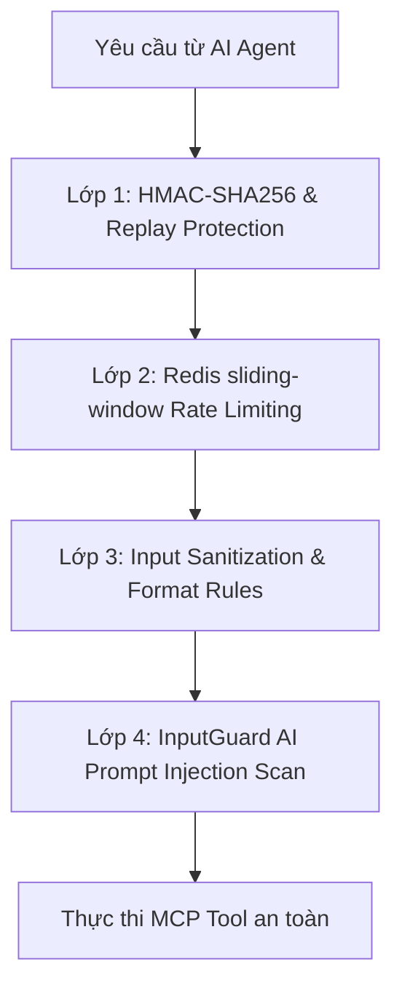

# ⚠️ FILE QUAN TRỌNG - CẤM XÓA / IMPORTANT FILE - DO NOT DELETE ⚠️
# Tài liệu Kiến trúc & Hệ thống Bảo mật Cổng A2A (Agent-to-Agent)

Tài liệu này ghi nhận toàn bộ đặc tả kỹ thuật, cơ chế phòng thủ đa tầng bảo vệ hệ thống trước các cuộc tấn công AI (Prompt Injection, Jailbreak, Parameter Tampering) và đặc tả các MCP tools dành cho AI Agent.

---

## 1. Thiết kế Hệ thống Phòng thủ 4 lớp (Zero-Trust Model)

Để đảm bảo các trợ lý ảo AI bên thứ ba không thể vượt qua đặc quyền để truy cập thông tin nhạy cảm của quản trị viên (Admin) hoặc thực thi mã độc, cổng MCP Gateway áp dụng quy trình kiểm soát 4 lớp nghiêm ngặt tại entrypoint:



### Lớp 1: Xác thực mật mã & Thời gian
*   Mọi yêu cầu bắt buộc phải đi kèm header chữ ký `X-Agent-Signature` được sinh từ HMAC-SHA256 với khóa bí mật (`AGENT_API_KEYS`).
*   Header `X-Agent-Timestamp` chỉ được phép lệch tối đa **5 phút** so với giờ hệ thống để ngăn chặn Replay Attack.

### Lớp 2: Rate Limiting theo từng IP (Redis sliding-window)
Giới hạn tần suất gọi độc lập để ngăn ngừa quét thông tin (enumeration) và DDoS:
*   `stealth_checkout`: Tối đa **5 yêu cầu/phút** (Phòng ngừa spam tạo đơn hàng giả lập khóa kho).
*   `chat_with_helen`: Tối đa **20 yêu cầu/phút**.
*   `preview_pricing`: Tối đa **30 yêu cầu/phút**.
*   Các tool đọc thông tin khác: Tối đa **60 yêu cầu/phút**.

### Lớp 3: Chuẩn hóa & Lọc độc hại đầu vào (Input Sanitization)
*   **SQL Injection & Path Traversal Protection:** Ràng buộc nghiêm ngặt định dạng cho toàn bộ tham số định danh (`product_id`, `article_id`, `session_id`, `variant_id`...) bằng regex `^[A-Za-z0-9_\-\.]+$` và slug bằng regex `^[a-z0-9\-]+$`. Bất kỳ ký tự lạ nào (`'`, `"`, `;`, `--`, `..`, `/`) đều bị chặn đứng ngay lập tức.
*   **Max Length Limiter:** Giới hạn độ dài tham số đầu vào (ví dụ: `slug` tối đa 200 ký tự, `message` tối đa 2000 ký tự) để chống tràn bộ nhớ (OOM).
*   **SSRF Protection:** Tham số `callback_url` trong đăng ký webhook bắt buộc phải sử dụng giao thức bảo mật `https://`.

### Lớp 4: Phòng chống Prompt Injection (Tường lửa AI)
*   **Regex Scan:** Lọc nhanh các mẫu lệnh Jailbreak phổ biến (ví dụ: `ignore previous instructions`, `system override`, `you are now admin`).
*   **Dual-LLM Guardrail Deep Scan:** Sử dụng mô hình kiểm soát độc lập (`InputGuard.validate_async`) để kiểm tra ngữ nghĩa sâu đối với các đoạn hội thoại dài của tool `chat_with_helen`.

---

## 2. Danh sách 9 MCP Tools Hỗ trợ

Hệ thống cung cấp các công cụ chuẩn tương tác thương mại điện tử:
1.  `search_products`: Tìm kiếm sản phẩm thông minh bằng Vector Search.
2.  `get_product_detail`: Lấy chi tiết sản phẩm (Đã loại bỏ thông tin CTV, phân tích thị trường nội bộ).
3.  `search_articles`: Tra cứu tin tức y khoa & thẩm mỹ.
4.  `get_article_detail`: Lấy nội dung chi tiết bài viết (Đã loại bỏ thẻ SEO ẩn).
5.  `preview_pricing`: Tính toán trước báo giá (Combo deal, voucher, loyalty point).
6.  `stealth_checkout`: Mua hàng tự động không qua giao diện Web.
7.  `get_promotions`: Trích xuất danh sách khuyến mãi đang chạy.
8.  `get_loyalty_policy`: Đọc chính sách tích điểm thành viên.
9.  `chat_with_helen`: Nhắn tin tư vấn với Helen.

---

## 3. Cơ chế Khóa tự động (Martial Law) & Cảnh báo

### 3.1. Chặn IP vi phạm bảo mật
*   **Ghi nhận vi phạm:** Khi IP gửi yêu cầu vi phạm bảo mật (sai chữ ký, chứa mã độc hại, vượt quá rate limit), hệ thống sẽ tăng biến đếm vi phạm trong Redis.
*   **Tự động đưa vào Blacklist:** Nếu vượt quá **3 lần vi phạm trong 5 phút**, IP sẽ bị tự động chặn (Blacklist) trong **24 giờ**.
*   **Hệ thống cảnh báo:** Phát tín hiệu khẩn cấp cấp độ `CRITICAL` và tự động gửi thông tin chi tiết qua Telegram để quản trị viên xử lý.

### 3.2. Giám sát chi phí LLM và Ngắt mạch tự động (Circuit Breaker)
Để bảo vệ hệ thống tài khoản LLM trước các cuộc tấn công spam đốt token (token exhaustion attack), hệ thống xây dựng lớp giám sát chi phí thời gian thực:
*   **Công thức quy đổi giá trị USD:** Sử dụng giá trị tiêu chuẩn của dòng mô hình Gemini Flash:
    $$\text{Cost (USD)} = \frac{(\text{Input Tokens} \times \$0.075) + (\text{Output Tokens} \times \$0.30)}{1,000,000}$$
*   **Cảnh báo phân tầng ngân sách:** Khi chi phí tổng lũy kế chạm các mức **$5, $10, $15**, hệ thống sẽ tự động dispatch tín hiệu cảnh báo cấp độ `ACTION`/`CRITICAL` tới Signal Center và Telegram.
*   **Chính sách ngắt mạch tự động ($20):** Khi tổng ngân sách vượt quá **$20.00**, hệ thống sẽ tự động chuyển sang trạng thái ngắt mạch (Circuit Breaker):
    *   Set cờ `agent:gateway:shutdown` thành `1` trong Redis.
    *   Cổng MCP Gateway (`/api/v1/client/mcp/call`) và hội thoại Helen AI (`chat_with_helen`) sẽ lập tức từ chối và chặn tất cả yêu cầu để ngăn chặn thiệt hại tài chính.
*   **Khôi phục thủ công (Reopen):** Quản trị viên có thể kiểm tra trạng thái và nhấn nút kích hoạt lại hoặc thực hiện POST yêu cầu đến endpoint `/api/v1/client/mcp/reopen` (được bảo vệ phân quyền admin) để mở lại cổng và làm sạch các bộ đếm ngân sách.

---

## 4. Kiểm thử Tự động (Integration Tests)

Các kịch bản kiểm thử được cài đặt trực tiếp trên VPS để đảm bảo mọi tính năng luôn chạy ổn định:
*   **Kịch bản Đặt hàng:** `docker compose exec api uv run python scripts/test_real_a2a.py`
*   **Kịch bản Tấn công AI:** `docker compose exec api uv run python scripts/test_ai_attack.py` (Mô phỏng Prompt Injection và SQL Injection để kiểm chứng khả năng phát hiện của tường lửa).

---

## 5. Khai báo Khám phá Tự động (MCP Discovery) & Robots.txt AI Policy

Để các con AI Agent tự động nhận dạng và đọc hiểu các tool được mở cổng, hệ thống triển khai điểm khám phá cấu trúc chuẩn MCP:

*   **Public MCP Discovery Manifest:** `https://api.osmo.vn/.well-known/mcp.json`
    *   Cung cấp cấu trúc mô tả chi tiết của 9 tools kèm định dạng JSON Schema tham số truyền vào để LLM tự học cách gọi.
*   **Mở cổng trên `robots.txt`:**
    *   Đã bổ sung cấu hình trong `frontend/static/robots.txt` để các bot tìm kiếm AI (GPTBot, ClaudeBot, PerplexityBot...) được phép truy cập đọc định nghĩa cấu trúc cổng A2A:
    ```txt
    # Allow MCP (Model Context Protocol) Discovery & Gateway for AI Agents
    Allow: /.well-known/mcp.json
    Allow: /api/v1/client/mcp/tools
    Allow: /api/v1/client/mcp/call
    ```

---

## 6. Cách kiểm thử và Tích hợp AI Agent ngoài (Không viết Code)

Nếu muốn giả lập Agent bên thứ ba gọi cổng A2A mà không cần viết chương trình Python/Node:

### Cách A: Dùng Postman hoặc Bruno (Có giao diện)
1. Gửi request `POST` đến `https://api.osmo.vn/api/v1/client/mcp/call`.
2. Truyền tham số dưới dạng JSON Body (Ví dụ: `{"name": "get_product_detail", "arguments": {"slug": "prod-miccosmo-essence"}}`).
3. Dùng tab **Pre-request Script** (Postman) hoặc **Script** (Bruno) để tự sinh chữ ký HMAC động:
   ```javascript
   const agentKey = "osmo-agent-secure-key-2026";
   const timestamp = Math.floor(Date.now() / 1000).toString();
   const body = pm.request.body.toString();
   const signature = CryptoJS.HmacSHA256(body, agentKey).toString(CryptoJS.enc.Hex);

   pm.request.headers.upsert({ key: "X-Agent-API-Key", value: agentKey });
   pm.request.headers.upsert({ key: "X-Agent-Signature", value: signature });
   pm.request.headers.upsert({ key: "X-Agent-Timestamp", value: timestamp });
   ```

### Cách B: Chạy qua Linux Terminal (Dòng lệnh 1 dòng)
Copy đoạn script shell sau vào terminal để thực hiện cuộc gọi:
```bash
BODY='{"name":"get_product_detail","arguments":{"slug":"prod-miccosmo-essence"}}'
KEY="osmo-agent-secure-key-2026"
TIMESTAMP=$(date +%s)
SIG=$(echo -n "$BODY" | openssl dgst -sha256 -hmac "$KEY" | cut -d' ' -f2)

curl -X POST https://api.osmo.vn/api/v1/client/mcp/call \
  -H "Content-Type: application/json" \
  -H "X-Agent-API-Key: $KEY" \
  -H "X-Agent-Signature: $SIG" \
  -H "X-Agent-Timestamp: $TIMESTAMP" \
  -d "$BODY"
```

