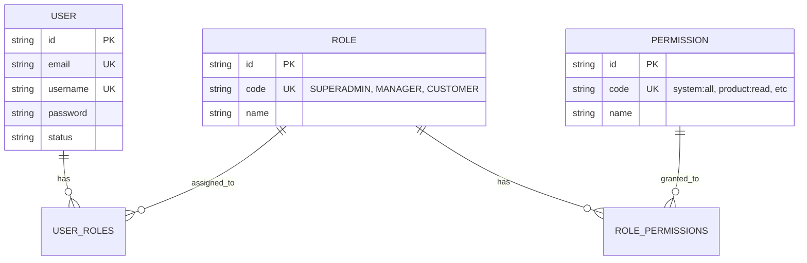
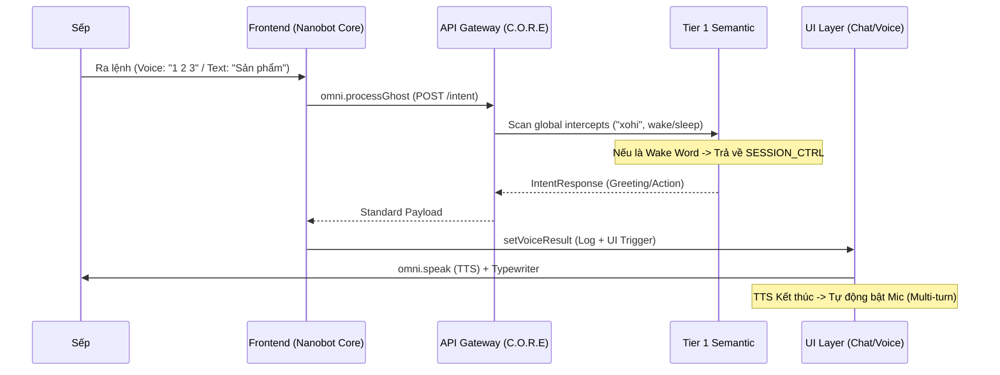
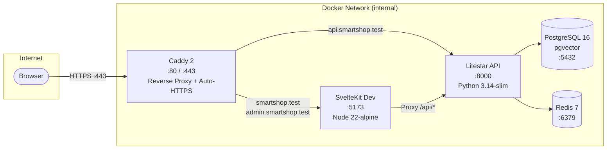
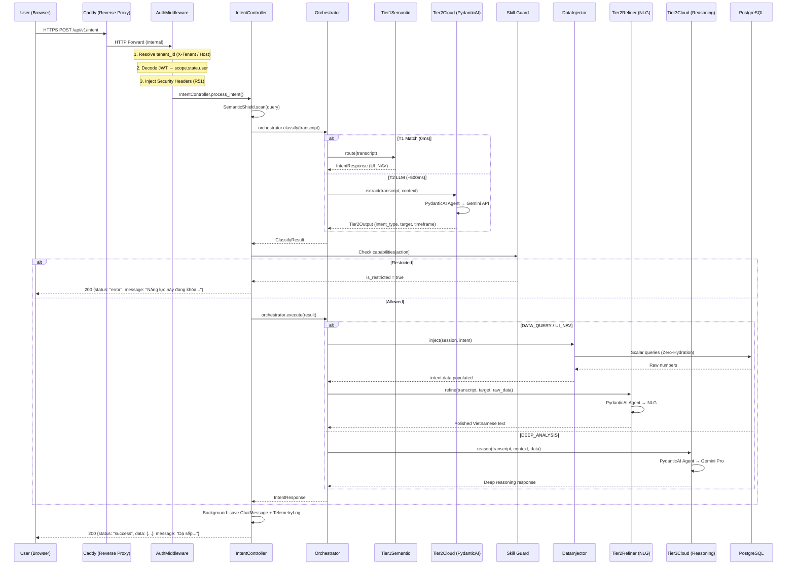
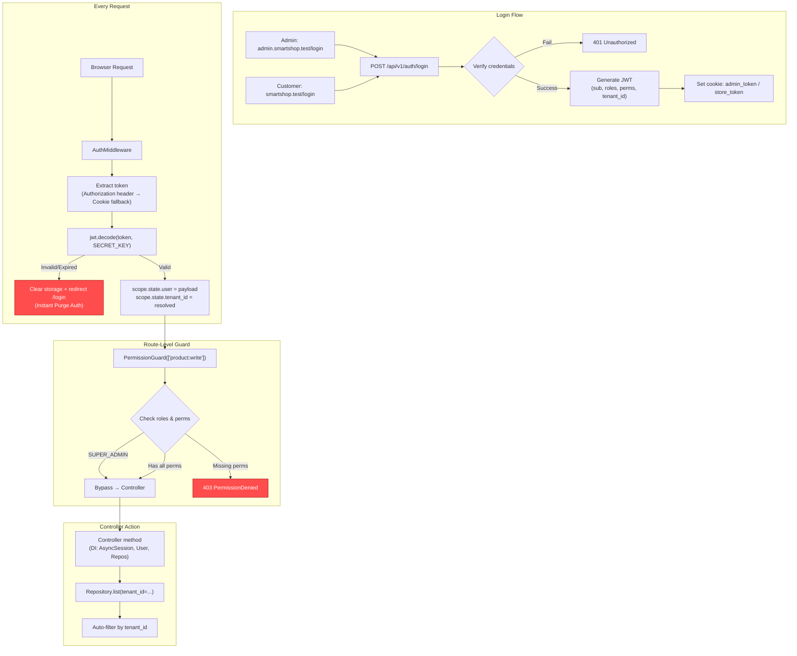
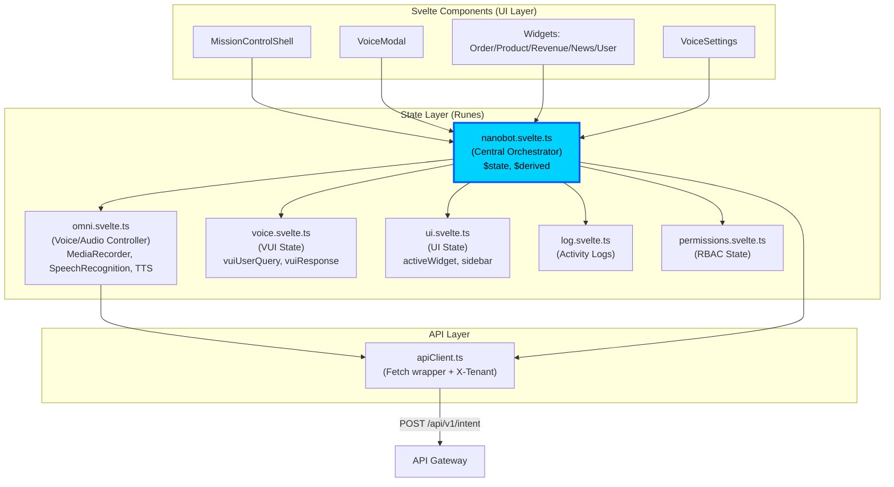
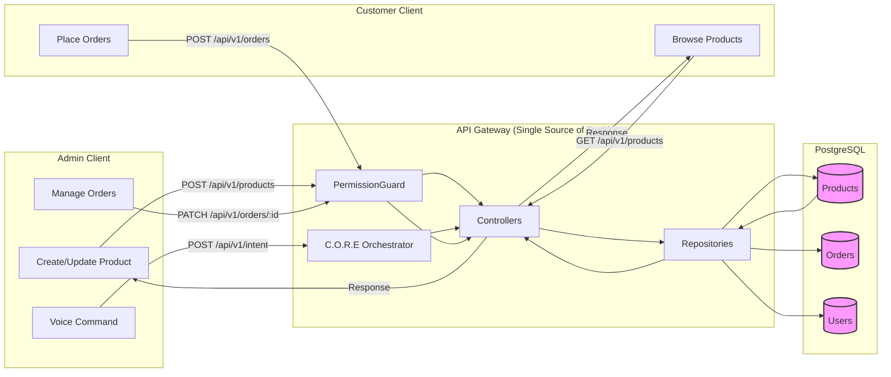
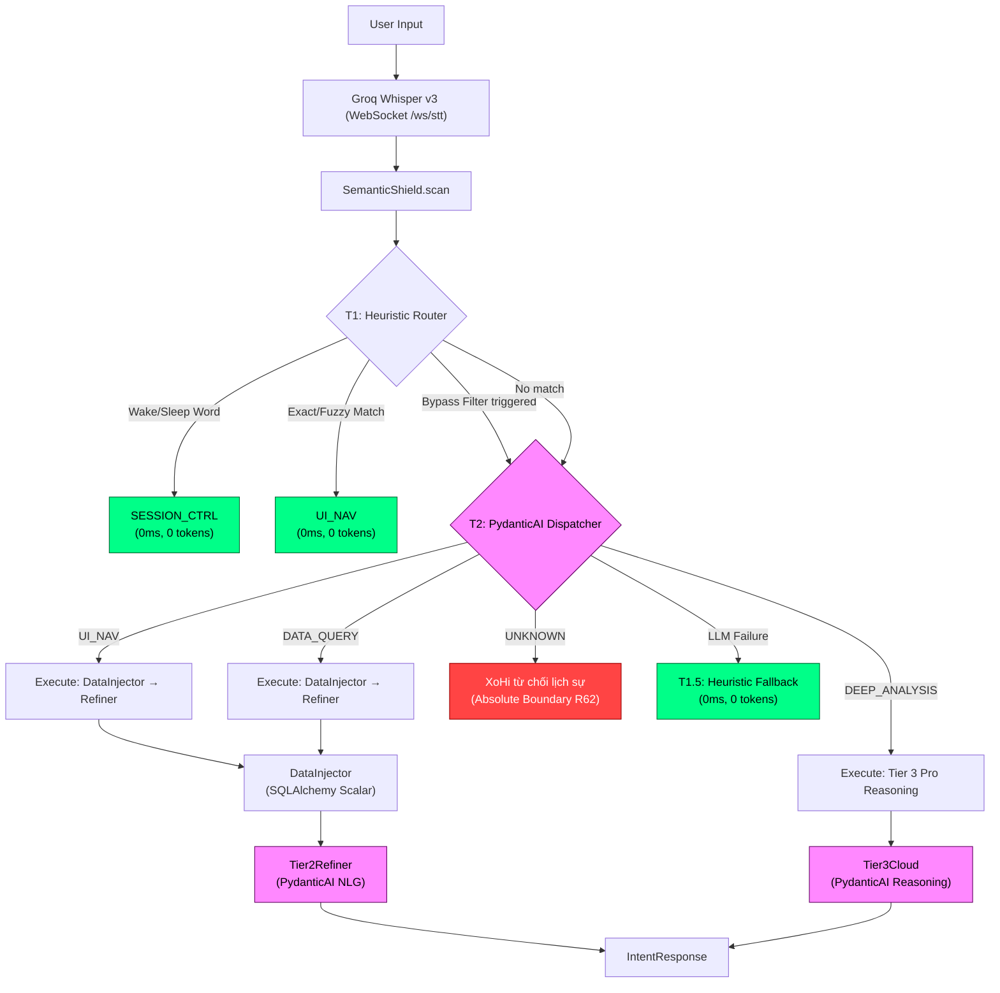

# HIẾN PHÁP FAST-PLATFORM (V61.0 + V56.0 HOTFIX — THIẾT QUÂN LUẬT)

> **CHỈ THỊ CHO AI IDE:** Dự án Agentic AI 2026. Stack cố định: **SvelteKit 5 (Runes) + Litestar (Python 3.14-slim) + SQLAlchemy 2.0 (AdvancedAlchemy) + PydanticAI + LiteLLM**. Tuyệt đối KHÔNG dùng React/Next.js/FastAPI/Prisma. Mọi file tạo ra phải tuân thủ nghiêm ngặt các nguyên lý "THIẾT QUÂN LUẬT" (Hardened Architecture).

---

## I. ĐIỀU KIỆN NỀN & MÔI TRƯỜNG

**Deployment: VPS 2 vCPU, 2GB RAM, có Swap.** Mọi quyết định kiến trúc phải soi chiếu qua giới hạn phần cứng này.

### 1.1 Zero-Local-LLM

Tuyệt đối CẤM chạy Ollama, Llama.cpp hay bất kỳ LLM nào trên VPS. Mọi gánh nặng AI phải đẩy sang Cloud API qua PydanticAI Agent (ưu tiên) hoặc `await acompletion()` (fallback proxy). CẤM dùng `completion()` đồng bộ trên Litestar — gây blocking I/O nghẽn event loop.

### 1.2 Full Async I/O

Mọi lời gọi LLM Cloud, database query (SQLAlchemy `AsyncSession`), và network request trên backend Litestar BẮT BUỘC phải là `async/await`. Không có ngoại lệ.

### 1.3 Kỷ luật Bộ nhớ

- `AudioContext.close()` sau mỗi recording session.
- Đóng triệt để WebSockets, DB Connections khi không sử dụng.
- Component quản lý DOM Stream (thẻ `<audio>`, Camera) CẤM dùng `{#if}` để ẩn/hiện — phải dùng CSS `class="hidden"` để giữ DOM sống.
- Mọi file KHÔNG ĐƯỢC vượt quá **300 LOC**. Vượt phải tách nhỏ.

### 1.4 Single Source of Truth (.env)

- CẤM hardcode bất kỳ URL/Domain nào trong source code.
- BẮT BUỘC khai báo mọi URL từ `.env` qua biến `PUBLIC_SSOT_ADMIN_URL`, `PUBLIC_SSOT_API_URL`, `PUBLIC_SSOT_STORE_URL`.
- Cấu hình LLM: `APP_TIMEZONE`, `TIER2_MODEL`, `TIER2_FALLBACK_MODEL`, `TIER3_MODEL`, `TIER3_FALLBACK_MODEL` đều lấy từ `os.getenv()`.
- Cấu hình DB: `DATABASE_URL` khai báo trong `.env`, dùng cho SQLAlchemy async engine (`asyncpg`).

### 1.5 Zero-Hydration Rule (Database — AdvancedAlchemy)

Khi thực hiện `COUNT` hoặc `SUM` doanh thu, TUYỆT ĐỐI CẤM load ORM Objects vào RAM. BẮT BUỘC sử dụng truy vấn Scalar:

```python
# ✅ ĐÚNG: Zero-Hydration — chỉ lấy số, không load object
total = await session.scalar(select(func.sum(Order.total_amount)).where(...))
count = await session.scalar(select(func.count(Order.id)).where(...))

# ❌ SAI: Load toàn bộ ORM objects rồi đếm/cộng trong Python
orders = await session.execute(select(Order).where(...))
total = sum(o.total_amount for o in orders.scalars().all())  # GIẾT RAM
```

- Giới hạn Connection Pool: `pool_size=5`, `max_overflow=10` (VPS 2GB RAM).
- CẤM `select(Model)` khi chỉ cần aggregate. Mỗi ORM object tiêu tốn ~2-5KB RAM.

### 1.6 Native JSON Schema Rule (AI — PydanticAI & LiteLLM)

- CẤM sử dụng cơ chế auto-retry của PydanticAI cho structured output.
- BẮT BUỘC dùng PydanticAI Agent với `output_type=PydanticModel` để ép khuôn dữ liệu ngay tại API call.
- Cache schema ở Global Scope (module-level constant), CẤM tạo lại schema mỗi request.
- CẤM parse JSON thủ công bằng regex (`re.search(r'\{.*\}', ...)`) khi đã dùng PydanticAI Agent.

### 1.7 Animation Bypass Rule (Frontend — Svelte 5)

- CẤM lưu trữ biến tần số âm thanh (Volume/Frequency) vào `$state` để làm hiệu ứng Voice Orb.
- Lý do: `$state` trigger Svelte reactivity → DOM reconciliation 60 lần/giây → CPU spike trên VPS 2 vCPU.
- BẮT BUỘC dùng Web Audio API + `requestAnimationFrame` update trực tiếp qua CSS Variables:

```javascript
// ✅ ĐÚNG: Bypass Svelte reactivity, update CSS trực tiếp
requestAnimationFrame(() => {
  element.style.setProperty("--orb-scale", volume.toString());
});

// ❌ SAI: Trigger Svelte DOM diffing 60fps
let volume = $state(0); // MỖI FRAME gây re-render
```

### 1.7.5 CSS Rendering Constraints for Low-End Infrastructure (V58.2 Update)

- CẤM Lạm dụng GPU / Hardware Acceleration: Tuyệt đối **KHÔNG dùng** các thuộc tính như `will-change: transform`, `transform: translate3d()`, hoặc tạo hiệu ứng Transition nặng trên `grid-template-columns` cho các Component quản lý cấu trúc Layout chính.
- Lý do: Trên VPS giới hạn (2 vCPU, 2GB RAM) hoặc các máy trạm/client cũ, việc chuyển giao Composite Layers sang GPU ảo/tích hợp tĩnh sẽ gây ra hiện tượng Paint/Layout Thrashing (Re-flow cực lớn) → Chết đứng luồng Main Thread, khiến Input lag nặng nề khi người dùng gõ phím.
- **Tiêu chuẩn Thiết kế CPU-Bound**: BẮT BUỘC sử dụng CSS Flexbox truyền thống (`display: flex`) kết hợp với Transition thuộc tính cơ bản (`transition: width 0.3s ease`) cho các thao tác Slide-in Layout / Split-view.
- **NGUYÊN TẮC VÀNG**: Nếu Animation làm giảm tốc độ nhận phím / Delay Mouse Click > 10ms -> LOẠI BỎ NGAY LẬP TỨC.

### 1.8 Async Anti-Blocking Rule (Runtime — Litestar)

- Hệ thống BẮT BUỘC khởi chạy bằng `uvloop` (cài qua `pip`, Litestar auto-detect).
- Các tác vụ CPU-bound (N-Gram Levenshtein ở Tier 1) BẮT BUỘC cắt cụt transcript đầu vào `< 500 ký tự` trước khi xử lý.
- Lý do: `difflib.SequenceMatcher` là O(n²) — input 2000 ký tự giam event loop ~50ms trên VPS 2 vCPU.
- CẤM chạy synchronous CPU-bound > 10ms trên event loop chính.

### 1.9 PydanticAI Dynamic Model Lifecycle (V66+)

- ❌ CẤM khởi tạo `Agent` với tham số `model` cố định ở global scope nếu hệ thống yêu cầu xoay vòng API Key (SmartKeyRotator).
- ✅ BẮT BUỘC khởi tạo `Agent` không có model, sau đó **instantiate Model instance động** (ví dụ: `GoogleModel` hoặc `GeminiModel`) bên trong vòng lặp retry tại service layer.
- ✅ Lý do: PydanticAI v1.66+ cache model/key tại thời điểm khởi tạo. Việc thay đổi `os.environ` sau khi Agent đã được gán model sẽ KHÔNG có tác dụng.
- ✅ Luồng chuẩn: `key = rotator.get_next_key()` -> `model_inst = GoogleModel(name, api_key=key)` -> `await agent.run(..., model=model_inst)`.
- ✅ **V56.0 Hotfix Applied:** `Tier2Refiner` (tier2_refiner.py) đã sửa — xóa `model=self.primary_model` ra khỏi Agent constructor.

### 1.10 Encoder Singleton Rule (V56.0)

- ❌ CẤM tạo nhiều instance `fastembed.TextEmbedding` ở các module khác nhau. Mỗi instance tốn ~90MB RAM.
- ✅ BẮT BUỘC dùng `get_shared_encoder()` từ `ai_engine.core.encoder_singleton` — singleton duy nhất cho toàn hệ thống.
- ✅ Warmup tại lifespan: `await warmup_encoder()` chạy trong `main.py` lifespan hook để đảm bảo Zero-Cold-Start.
- ✅ Các consumer: `vector_memory.py`, `semantic_router.py`, `embedding_indexer.py` PHẢI delegate tới shared singleton.

### 1.11 Autonomous Heartbeat Rule (V56.0)

- ❌ CẤM chạy APScheduler in-process (SPOF — job crash ảnh hưởng main app).
- ❌ CẤM dùng cron/curl gọi ngược localhost (API chỉ expose qua Caddy reverse proxy, không bind host).
- ✅ BẮT BUỘC dùng `asyncio.create_task()` trong lifespan cho background heartbeat.
- ✅ Interval configurable qua env `ANOMALY_SCAN_INTERVAL` (mặc định 900s = 15 phút).
- ✅ Graceful shutdown: `task.cancel()` trong `finally` block của lifespan.
- ✅ Non-fatal: scan failure chỉ log warning, KHÔNG crash app.

### 1.12 Diacritic-Insensitive Search Rule (V56.0)

- ❌ CẤM dùng `ILIKE` thuần cho tìm kiếm sản phẩm/đơn hàng tiếng Việt — không match khi thiếu/thừa dấu.
- ✅ BẮT BUỘC bọc `func.unaccent()` trong điều kiện search cho các cột tiếng Việt (name, title).
- ✅ PostgreSQL extension `unaccent` PHẢI được cài (`CREATE EXTENSION IF NOT EXISTS unaccent`).
- ✅ Cột ASCII thuần (SKU, ID) KHÔNG cần unaccent.
- ✅ Ví dụ: `func.unaccent(ProductBase.name).ilike(f"%{func.unaccent(safe)}%")`.

---

## II. HỆ TRỤC TÁC NHÂN — C.O.R.E ROUTING PROTOCOL

**C.O.R.E = Central Orchestrated Routing Engine.**
Mọi request từ `intent.py` được giao toàn quyền cho `intent_orchestrator.py`. CẤM duplicate T1 call ở gateway.

### 2.1 The Secure Trinity Loop — Giao thức 3 Giai đoạn

BẮT BUỘC thực hiện tuần tự qua `Orchestrator` để đảm bảo an toàn hiến pháp:

1.  **Phase 1: Classify (Nhận diện)**:
    - T1 (Heuristic) hoặc T2 (Dispatcher - `tier2_cloud.py`).
    - Mục tiêu: Chỉ xác định `IntentAction` và trích xuất tham số thô.
    - **PydanticAI Agent**: T2 Dispatcher BẮT BUỘC bọc trong `pydantic_ai.Agent` với `result_type` là Pydantic model ép kiểu tĩnh 100%. LLM output tự động được validate và self-correct khi ảo giác (hallucination).
2.  **Phase 2: Skill Guard (Chốt chặn)**:
    - Kiểm tra quyền hạn tại `intent.py` NGAY LẬP TỨC sau khi Classify.
    - Nếu bị khóa (Restricted) -> Dừng toàn bộ, KHÔNG gọi Data Injector hay Tier 3.
3.  **Phase 3: Execute (Thực thi)**:
    - **Loop A (Provider)**: `DataInjector` bơm dữ liệu thực từ SQLAlchemy queries.
    - **Loop B (Refiner)**: `Tier2Refiner` (`tier2_refiner.py`) thẩm mỹ hóa dữ liệu thành văn bản.
    - **Deep Analysis**: Gọi Tier 3 Pro Reasoning (bọc trong PydanticAI Agent).

```mermaid
graph TD
    User([Sếp]) --> Gateway[intent.py: Gateway]

    subgraph CORE ["C.O.R.E Orchestrator (Sub-Second Path)"]
        Gateway --> NFC_Normalize["<b>Phase 0: NFC Normalization</b><br/>unicodedata.normalize('NFC')"]

        NFC_Normalize --> STTLayer{"<b>STT Pre-Processor</b><br/>stt_corrector.py<br/><i>(Redis Memory)</i>"}

        STTLayer -- "Memory Bypass < 1ms" --> T1_Check
        STTLayer -- "Ambiguous" --> STT_AI[Gemini 1.5 Flash]
        STT_AI -- "Suspected" --> Confirmation([Hỏi: Ý sếp là...?])
        Confirmation -- "Learn" --> STTLayer

        T1_Check{"<b>Tier 1: Wake/Sleep</b><br/><i>(Heuristic)</i>"}

        STTLayer -- "Learned Path" --> T1_Check
        T1_Check -- "Match < 10ms" --> Guard

        T1_Check -- "Miss" --> T15_Check["<b>Tier 1.5: Semantic Router</b><br/><i>(Embedding Cosine Sim)</i>"]

        T15_Check -- "Score ≥ 0.75" --> Guard
        T15_Check -- "Score < 0.75" --> T2_AI[Tier 2 Cloud Router]

        Guard{"<b>Phase 2: Skill Guard</b><br/><i>(RBAC Check)</i>"}
        T2_AI --> Guard

        Guard -- "Allowed" --> Execute{"<b>Phase 3: Execute</b>"}

        subgraph TrinityLoop ["Hybrid Trinity Loop"]
            direction TB
            Execute -- "Data Query" --> Provider[<b>Step A: Provider</b><br/>data_injector.py]
            Provider --> RefinerCheck{"<b>Step B: Refiner Logic</b>"}
            RefinerCheck -- "Simple Num < 200ms" --> FastRefiner[Fast Template]
            RefinerCheck -- "Complex Text" --> RefinerAI[Tier 2 Refiner LLM]

            Execute -- "Deep Analysis / Unknown" --> RAG[<b>Vector RAG</b><br/>pgvector search]
            RAG --> T3_Pro[<b>Tier 3 Pro Reasoning</b><br/>Deep/Agentic Planning]
        end
    end

    FastRefiner --> Final
    RefinerAI --> Final
    T3_Pro --> Final
    Final([Xohi: "Báo cáo sếp..."])

    classDef fast fill:#9f9,stroke:#333,stroke-width:2px;
    class NFC_Normalize,STTLayer,T1_Check,T15_Check,FastRefiner,Provider fast;
    classDef ai fill:#f9f,stroke:#333,stroke-width:2px;
    class STT_AI,T2_AI,RefinerAI,T3_Pro ai;
    classDef memory fill:#ff9,stroke:#333,stroke-width:2px;
    class STTLayer,RAG memory;
```

```text
intent.py (Gateway)
  └─ Orchestrator (Classify)
       ├─ Phase 0: Redis STT Pre-processing & Inline Wake/Sleep Check (0ms)
       ├─ Tier 1.5: Semantic Router (Cosine Similarity Embedding) -> Bypass T2
       └─ Tier 2: PydanticAI Agent Dispatcher (tier2_cloud.py) -> Type-Safe JSON
  └─ SKILL GUARD (Constitutional Gate)
  └─ Orchestrator (Execute)
       ├─ Trinity Loop: Injector (SQLAlchemy) -> Refiner (tier2_refiner.py)
       └─ Tier 3 (RAG Enabled): pgvector Search -> PydanticAI Deep Analysis
```

### 2.2 PydanticAI Agent Wrapping — The "Deps" Protocol

Mọi logic LLM phức tạp (Dispatcher, Refiner, T3 Reasoning) BẮT BUỘC bọc trong `pydantic_ai.Agent` sử dụng **RunContext/Deps**:

```python
@dataclass
class Tier2Deps:
    screen_context: Optional[dict] = None
    rotator: SmartKeyRotator = None

# V56.0: CẤM model= ở đây nếu dùng SmartKeyRotator (Rule 1.9)
agent = Agent(
    deps_type=Tier2Deps,
    result_type=Tier2Output
)

@agent.system_prompt
def add_context(ctx: RunContext[Tier2Deps]) -> str:
    # CẤM dùng f-string format thủ công vào agent.system_prompt string
    # BẮT BUỘC dùng decorator để inject context động từ deps
    if ctx.deps.screen_context:
        return f"\n[SCREEN_CONTEXT]\n{json.dumps(ctx.deps.screen_context)}"
    return ""
```

- **PydanticAI** đóng vai trò **Type-Safe Orchestrator** — ép kiểu 100% output, tự retry khi LLM hallucinate sai schema.
- **LiteLLM** đóng vai trò **API Gateway / Fallback Proxy** ở tầng dưới cùng — routing multi-provider, key rotation, rate-limit handling.
- CẤM gọi trực tiếp `acompletion()` cho logic phức tạp có structured output. Chỉ dùng `acompletion()` cho text-only generation cực kỳ đơn giản.

### 2.3 An toàn Bộ nhớ Prompt (Anti-Prompt-Bomb)

- `messages = list(context) if context else []` BẮT BUỘC đặt **NGOÀI** vòng lặp retry.
- CẤM dùng `context or []` — mutate tham chiếu gốc, gây prompt đẻ trứng.
- System prompt phải `insert(0, ...)` lên đầu mảng. CẤM `append` xuống cuối.

### 2.4 ~~Chống Markdown JSON Trap~~ → Native Structured Output (V55.1)

> **[DEPRECATED]** Regex JSON parsing (`re.search(r'\{.*\}', ...)`) đã bị LOẠI BỎ hoàn toàn từ V55.1.

T2 Dispatcher BẮT BUỘC dùng PydanticAI Agent với `output_type=Tier2Output`. LLM output tự động validate và deserialize thành Pydantic model. CẤM parse JSON thủ công.

```python
# ✅ V55.1: PydanticAI ép kiểu tĩnh 100%
agent = Agent(model="...", output_type=Tier2Output)
result = await agent.run(transcript, deps=deps)
output: Tier2Output = result.data  # Type-safe, auto-validated

# ❌ DEPRECATED: Regex JSON trap
# match = re.search(r'\{.*\}', result_text, re.DOTALL)
```

### 2.5 Ngữ cảnh Hội thoại (Context Memory)

```text
intent.py: fetch 10 tin nhắn → list(context) copy an toàn
  → Orchestrator: T1 check → T2 nhận context + screen_context
  → messages = list(context) → insert system prompt đầu → append user prompt cuối
  → KHÔNG mutate context gốc
  → Background task: Lưu query + response (tier_str .value) vào ChatMessage
```

- `system_context` = cấu hình tĩnh (Schema, Domain).
- `screen_context` = dữ liệu động (Route, Widget ID hiện tại).
- Hai cục này phải tách bạch đồng cấp trong payload.

### 2.5 Widget Action Contract

Mọi `ui_action` từ T1/T2 BẮT BUỘC thuộc whitelist sau (1:1 với frontend `ACTION_WIDGET_MAP`):

| ui_action                    | Widget                | Target  |
| ---------------------------- | --------------------- | ------- |
| `show_revenue_chart`         | REVENUE_CHART         | revenue |
| `show_order_management`      | ORDER_MANAGEMENT      | order   |
| `show_product_management`    | PRODUCT_MANAGEMENT    | product |
| `show_user_management`       | USER_MANAGEMENT       | user    |
| `show_user_table`            | USER_TABLE            | user    |
| `show_category_management`   | CATEGORY_MANAGEMENT   | —       |
| `show_news_management`       | NEWS_MANAGEMENT       | —       |
| `show_permission_management` | PERMISSION_MANAGEMENT | —       |
| `show_voice_settings`        | VOICE_SETTINGS        | —       |

- **DATA_QUERY:** BẮT BUỘC xóa `ui_action = ""` — chỉ đọc số, KHÔNG mở widget.
- **UI_NAV:** Giữ `ui_action` → frontend mở widget + Data Injector bơm `data.revenue`/`data.period_label`.
- **T1:** Phải inject `intent_type: "UI_NAV"`, `target`, `timeframe` vào data để Data Injector fetch DB.

### 2.7 Giao thức STT & Bộ Nhớ Tương Tác (V61.0+)

Hệ thống BẮT BUỘC tuân thủ cơ chế **"Local-First, AI-Last"** để đảm bảo phản hồi < 1 giây:

1.  **Phase 0: NFC Normalization (BẮT BUỘC)**:
    - Mọi input transcript BẮT BUỘC được `unicodedata.normalize('NFC', text)` tại gateway.
    - Lý do: Tiếng Việt có 2 cách mã hóa dấu (NFC/NFD). Nếu không chuẩn hóa, so khớp cục bộ (Memory/Pattern) sẽ bị lệch "ma trận", dẫn đến việc phải gọi AI tốn kém dù sếp nói đúng 100%.
2.  **Lớp Memory & Pattern Bypass (Bypass 1 - Sub-1ms)**:
    - BẮT BUỘC chạy `local_correct` (Learned Memory) và `NAV_PATTERNS` check trước khi khởi tạo LLM.
    - Cấu trúc: So khớp memory trước -> Sửa lỗi STT -> Check pattern điều hướng (mở biểu đồ, cút, thoát).
    - Nếu khớp -> **Trả kết quả ngay lập tức, bỏ qua hoàn toàn AI STT**.
3.  **Lớp Tự Học (Interaction Loop)**:
    - Nếu AI không chắc chắn (`suspected_correction`), BẮT BUỘC dừng luồng `execute`, chuyển sang trạng thái chờ xác nhận (`is_confirming_stt = True`).
    - Khi nhận "Phải / OK / Đúng", BẮT BUỘC ghi vĩnh viễn vào `stt_dictionary`.
4.  **Lớp Parallel Data Injection (Execute Phase)**:
    - Trong `data_injector.py`, các lời gọi DB aggregation (Daily/Monthly/Yearly/Quarterly) BẮT BUỘC dùng `asyncio.gather` để chạy song song.
    - Lý do: Giảm latency từ ~800ms xuống < 200ms cho các dashboard phức tạp.
5.  **Lớp Fast Refiner (Bypass 2)**:
    - Với các câu trả lời số liệu đơn giản (INT/FLOAT), BẮT BUỘC dùng Template tĩnh tiếng Việt kèm Modality Log Prefix (`[c]` / `[v]`).

### 2.8 Bản đồ Thư mục (Thực tế V55.0)

```text
fast-platform/
├── apps/
│   ├── ui-core/                       # SvelteKit 5 (Runes, Tailwind v4)
│   │   └── src/
│   │       ├── lib/
│   │       │   ├── components/admin/  # V55.0 Unified Admin UI
│   │       │   │   ├── layout/         # DesktopLayout, MobileLayout (V55.0 Branding)
│   │       │   │   ├── management/     # RBAC UI, Product, Order, Category, News, Voice
│   │       │   │   └── ui/             # UniversalModal, MissionControlShell
│   │       │   ├── state/              # NanoBot Orchestrator (Svelte Runes)
│   │       │   └── api/                # Auto-generated Types (Rule 3.5)
│   ├── api-gateway/                   # Litestar (Python 3.14-slim)
│   │   ├── migrations/                # Alembic Migrations (Source of Truth)
│   │   ├── scripts/                   # seed_admin.py (RBAC Seed)
│   │   ├── src/
│   │   │   ├── main.py                # Entry point + Lifespan (Warmup + Heartbeat)
│   │   │   ├── guards.py              # PermissionGuard (Many-to-Many RBAC)
│   │   │   ├── middleware.py          # Auth + Security Headers (R51)
│   │   │   ├── database/
│   │   │   │   ├── models.py          # SQLAlchemy ORM (M2M RBAC Schema)
│   │   │   │   └── repositories.py    # Async Repositories (AdvancedAlchemy)
│   │   │   ├── controllers/           # Class-based Controllers (N+1 Optimized)
│   │   │   │   └── health.py          # V56.0: HealthCheck + AnomalyScanner
│   │   │   ├── routers/
│   │   │   │   └── intent.py          # C.O.R.E Gateway
│   │   │   └── services/
│   │   │       ├── anomaly_detector.py # V56.0: Scalar-only anomaly detection
│   │   │       └── routing/
│   │   │           ├── intent_orchestrator.py  # C.O.R.E (≤363 LOC)
│   │   │           └── heuristic_classifier.py # V56.0: Extracted from orchestrator
│   │   └── tests/                     # Security & RBAC Bypass Tests
└── packages/
    └── ai-engine/
        └── core/
            ├── encoder_singleton.py    # V56.0: Shared fastembed model
            ├── semantic_router.py      # T1.5 Intent Classification
            └── vector_memory.py        # pgvector Search
```

### 2.7 Resilience: Model Fallback Chain + Backoff

Mọi lời gọi Cloud LLM (Tier 2/3) BẮT BUỘC triển khai **Model Fallback Chain**:

**Chuỗi ưu tiên:** `TIER2_MODEL` (primary) → `TIER2_FALLBACK_MODEL` (fallback) → Template (last resort, chỉ Refiner).

- **503 (ServiceUnavailableError):** Model bị outage → rotate key, nếu hết key → chuyển sang fallback model.
- **429 (RateLimitError) / Timeout:** Model bị rate-limit hoặc timeout → backoff `1.5s × (attempt + 1)` rồi retry key khác. Import `Timeout as LiteLLMTimeout` từ litellm.
- **AuthenticationError:** Key lỗi → rotate key ngay, không backoff.
- **Giới hạn:** Tối đa 3 key mỗi model. Tổng worst-case: 6 attempts (3 primary + 3 fallback).
- **Env:** `TIER2_FALLBACK_MODEL=gemini/gemini-2.0-flash` trong `.env`.
- **Tự phục hồi:** Khi primary model phục hồi → hệ thống tự động dùng lại primary (không cần sửa config).

```text
Primary (gemini-3-flash-preview)
  Key1 → 503 → Key2 → 503 → Key3 → 503
  ↓ Fallback
Fallback (gemini-2.0-flash)
  Key1 → 429 → wait 1.5s → Key2 → ✅ Success
```

---

## III. BẢO MẬT & DỮ LIỆU

### 3.1 Cognitive Capability Matrix — Skill Guard (IntentAction Guard)

> **⚠️ Lưu ý kiến trúc:** Các toggle trong VoiceSettings → "Cognitive Capability Matrix" kiểm soát **IntentAction**, **KHÔNG PHẢI Tier routing**. Tier 1/2/3 là tầng xử lý nội tại, hoạt động độc lập với cấu hình này.

**Mapping chính xác:**

| Toggle UI | IntentAction bị chặn | Ghi chú                                                                |
| --------- | -------------------- | ---------------------------------------------------------------------- |
| `READ`    | `READ` + `COUNT`     | `COUNT` tự động map vào `READ` guard (dùng chung nhóm Data Extraction) |
| `MUTATE`  | `MUTATE`             | Chặn mọi draft tạo/sửa/xoá qua Final Glance (R11)                      |
| `ANALYZE` | `ANALYZE`            | Chặn phân tích sâu — chủ yếu do Tier 3 Cloud LLM xử lý                 |

**Logic Guard trong `intent.py`:**

- **Guard runs PRE-EXECUTION**: Chạy ngay sau khi Classify, trước khi DB/LLM tốn tài nguyên.
- **Enum Hardening**: Luôn dùng `.value` hoặc `str()` khi so sánh IntentAction để chống crash.
- **Total Token Bill**: Phối hợp `cost_tokens` từ Dispatcher + Refiner để báo cáo chính xác.
- Heuristic Bypass (bao nhiêu / mấy / tổng số...) phải chạy **TRƯỚC** Guard để áp chính xác.
- Lookup dùng `caps.get(check_action, True)`: key vắng mặt → coi là **ENABLED** (safe default). CẤM dùng `check_action in caps and not caps[check_action]` — gây bypass khi user chưa save lần nào.
- Nếu tắt (`caps[action] == False`) → `is_restricted = True` → return lỗi tiếng Việt từ `ACTION_VI` map → CẤM gọi Data Injector.
- `ACTION_VI` BẮT BUỘC có đủ 4 key: `READ`, `COUNT`, `MUTATE`, `ANALYZE`.

**Nguồn dữ liệu caps:** `VoiceProfile.capabilities` (JSON column trong SQLAlchemy). Backend (`capability_registry.py`) cung cấp metadata; trạng thái `active` lưu per-user trong DB.

### 3.2 Cơ sở dữ liệu: SQLAlchemy 2.0 & AdvancedAlchemy

#### 3.2.1 AsyncSession — Kết nối Async Bắt Buộc

- Mọi database query BẮT BUỘC dùng `AsyncSession` của SQLAlchemy 2.0 với driver `asyncpg`.
- CẤM dùng `Session` đồng bộ trên Litestar — gây blocking I/O.
- Engine config:

```python
# V56.0: Engine tạo bởi AdvancedAlchemy plugin (main.py alchemy_config)
# CẤM tạo engine riêng trong database/__init__.py — gây Dual Engine Trap
from advanced_alchemy.extensions.litestar import SQLAlchemyAsyncConfig

alchemy_config = SQLAlchemyAsyncConfig(
    connection_string=os.getenv("DATABASE_URL"),  # postgresql+asyncpg://...
    pool_size=5,
    max_overflow=10,
    pool_recycle=3600,
)
```

- Litestar integration: Dùng `AdvancedAlchemy` plugin (`SQLAlchemyPlugin`) để tự động inject `AsyncSession` vào dependency injection.
- ⚠️ **V56.0 Known Debt:** `database/__init__.py` vẫn tạo engine riêng cho `async_session_maker` (5 files phụ thuộc). Cần migrate trong sprint sau.

#### 3.2.2 Tenant Isolation — Multi-Tenancy

- Mọi query tự động inject `tenant_id` filter qua custom Repository hoặc middleware.
- Model không có `tenant_id` (VoiceProfile, ChatMessage, Permission) được đánh dấu `TENANT_EXEMPT`.
- Frontend BẮT BUỘC gọi API qua `apiClient` (tự nhồi `X-Tenant` header). CẤM dùng `fetch()` thuần.

#### 3.2.3 JSON Columns

- Lưu JSON vào SQLAlchemy dùng type `JSON` hoặc `JSONB` (PostgreSQL):

```python
from sqlalchemy import JSON
from sqlalchemy.orm import Mapped, mapped_column

class VoiceProfile(Base):
    capabilities: Mapped[dict] = mapped_column(JSON, default=dict)
```

- CẤM dùng `json.dumps()` khi ghi — SQLAlchemy tự serialize.
- Truy xuất JSON field: `profile.capabilities.get("READ", True)`.

#### 3.2.4 AdvancedAlchemy Repository Pattern

- BẮT BUỘC dùng `SQLAlchemyAsyncRepository` từ AdvancedAlchemy để sinh CRUD tự động.
- **CẤM** tạo manual `async_session_maker()` bên trong routers hay controllers. Mọi truy cập DB phải thông qua **Repositories** được inject từ Litestar DI.
- Repository cung cấp sẵn: `list()`, `get()`, `get_one()`, `create()`, `update()`, `delete()`, `upsert()`, `count()`.
- CẤM viết raw SQL cho CRUD cơ bản. Raw SQL chỉ dùng cho aggregation phức tạp (SUM, GROUP BY).
- Relation loading: Dùng `selectinload()` hoặc `joinedload()` thay vì `include` của Prisma.

#### 3.2.5 Master Mixins (THIẾT QUÂN LUẬT)

Mọi model logic BẮT BUỘC kế thừa bộ 3 Mixins sau để đảm bảo tính nhất quán:

- **AuditMixin**: Tự động hóa `created_at`, `updated_at`.
- **SoftDeleteMixin**: Quản lý `deleted_at`, logic "Xóa là ẩn".
- **TenantMixin**: Cô lập dữ liệu theo `tenant_id`.

#### 3.2.6 Advanced Indexing

- BẮT BUỘC đánh index composite `(tenant_id, deleted_at)` cho mọi bảng dùng Mixins.
- Query performance target: **< 100ms** cho tập dữ liệu triệu bản ghi (PostgreSQL optimized).

#### 3.2.7 Alembic Migrations

- Migration files nằm tại `api-gateway/migrations/`.
- Tạo migration: `alembic revision --autogenerate -m "description"`.
- Chạy migration: `alembic upgrade head`.
- CẤM sửa migration đã chạy trên production. Tạo migration mới để rollback/fix.

#### 3.2.8 Bản đồ Quan hệ ORM (Many-to-Many RBAC)

Hệ thống RBAC trong V55.0 sử dụng bảng trung gian (`association tables`) để đảm bảo tính linh hoạt tối đa:



- **Quy tắc Vàng (R34):** Mỗi record chỉ có 1 owner logic.
- **Quy tắc FK (R36):** Foreign Key KHÔNG cấp quyền truy cập. Quyền luôn phải qua `PermissionGuard`.

#### 3.2.9 N+1 Optimization (Rule R41)

Tuyệt đối cấm N+1 query khi load relationships Many-to-Many:

- **BẮT BUỘC** dùng `selectinload()` cho các tập hợp (roles, permissions).
- **Controller Logic**: Luôn load roles/perms ngay tại tầng query đầu tiên để JWT claims đầy đủ.

```python
# Đúng (N+1 Safe)
stmt = select(User).options(selectinload(User.roles).selectinload(Role.permissions))
```

### 3.3 Security Headers (Rule R51)

Mọi phản hồi từ `api-gateway` BẮT BUỘC chứa các headers bảo mật sau (tiêm qua `AuthMiddleware` Chi tiết tại src/middleware.py):

- `Content-Security-Policy: default-src 'self'`
- `X-Frame-Options: DENY`
- `X-Content-Type-Options: nosniff`
- `Referrer-Policy: strict-origin-when-cross-origin`
- `Permissions-Policy: geolocation=(), microphone=()`
- `Strict-Transport-Security: max-age=31536000`

### 3.4 RBAC Hardening Protocol (Rule R31-R40)

BẮT BUỘC tuân thủ các quy tắc sau cho mọi module mới:

BẮT BUỘC tuân thủ các quy tắc sau cho mọi module mới:

- **R31 – Auth UI Is Role-Specific**: Admin (`admin.smartshop.test`) và Customer (`smartshop.test`) tách biệt hoàn toàn về UI và Route.
- **R32 – Admin Auth Is Hardened**: Admin domain riêng, bắt buộc Rate limit riêng và Audit log.
- **R34 – One Logical Owner Per Record**: Chặn role escalation ngay từ schema. Owner ≠ Operator.
- **R36 – Foreign Key Never Grants Permission**: Permission luôn kiểm tra bằng policy/guard, không bao giờ tin vào việc Join thành công.
- **R40 – No Cross-Service Relationship**: Dùng ID hoặc Event để liên kết dữ liệu giữa các micro-services (nếu có).

### 3.5 Chống Ảo giác Dữ liệu (Trinity Grounding)

- **Nguyên lý Trinity Loop**: CẤM LLM tự bịa số liệu. Mọi câu trả lời chứa số liệu (Đơn hàng, Doanh thu, User) phải đi qua luồng: **Fetch DB Thực (SQLAlchemy) -> Feed cho LLM Refiner**.
- **Data Provider (DataInjector.py)**: Nhiệm vụ duy nhất là fetch raw data qua Repository/Session. CẤM dùng template cứng nhắc.
- **Refiner (Tier 2/3)**: Tự biên soạn câu trả lời dựa trên raw data được cung cấp. Cần ngắn gọn, sắc sảo.

### 3.6 Instant Purge Auth

- Token hết hạn hoặc HTTP 401/403 → clear toàn bộ storage + redirect `/login` ngay lập tức.
- CẤM lưu token vào `localStorage` vĩnh viễn mặc định. "Remember Me" = 7 ngày. Mặc định = `sessionStorage`.
- CẤM global state (`nanobot.svelte.ts`) gọi API tự động khi đang ở `/login` — tránh vòng lặp tử thần 401.

### 3.7 OpenAPI-TypeScript Bridge — Type-Safe Frontend

BẮT BUỘC sinh tự động file `types.ts` cho frontend SvelteKit dựa trên schema OpenAPI của Litestar:

```bash
# Sinh types từ OpenAPI schema — chạy mỗi khi API thay đổi
npx openapi-typescript http://localhost:8000/schema/openapi.json -o src/lib/api/types.ts
```

**Quy tắc:**

- CẤM tự viết type/interface thủ công cho API response ở Frontend. Mọi type phải auto-generated.
- File `src/lib/api/types.ts` KHÔNG ĐƯỢC sửa tay. Chỉ sinh lại bằng lệnh trên.
- Litestar tự sinh OpenAPI schema từ Pydantic DTOs. Luồng: **Pydantic DTO (BE) → OpenAPI JSON → openapi-typescript → types.ts (FE)**.
- Khi thêm/sửa API endpoint: Chạy lại lệnh sinh type → commit cả `types.ts`.
- Frontend import type: `import type { components } from '$lib/api/types'`.

**Anti-Drift:**

- Đứt gãy type giữa BE ↔ FE là vi phạm hiến pháp. OpenAPI Bridge là cầu nối duy nhất được phép.
- CI/CD nên có bước verify rằng `types.ts` khớp với OpenAPI schema mới nhất.

---

## IV. TRẢI NGHIỆM GIỌNG NÓI (VOICE UX)

### 4.1 Voice-Centric Philosophy & Master Map

> **TRIẾT LÝ:** Tại SmartShop, **Voice không phải là tính năng thêm vào, mà là giao diện trung tâm.** Mọi logic backend và frontend đều phải tối ưu cho việc điều khiển bằng giọng nói, giảm thiểu click chuột và tối đa hóa sự rảnh tay của Sếp.

**Bản đồ Kiến trúc Voice Toàn cảnh (Unified Backend-Driven Flow):**



**Chi tiết luồng thực thi (V58.0):**

1. **User Ra Lệnh** → `Nanobot Core` KHÔNG kiểm tra wake word tại chỗ. Tất cả đẩy xuống `omni.processGhost()`.
2. **STT Pipeline (2026)**: Browser Mic → WebSocket `/ws/stt` → Backend → **Groq Whisper v3-turbo** (via `litellm.atranscription()`) → 95% accuracy tiếng Việt. Fallback: Web Speech API (Chrome/Edge).
3. **Backend Gateway**: `SemanticShield.scan()` (jailbreak detection) → `Tier 1 Semantic` kiểm tra bộ từ khóa người dùng + `xohi` (Global Intercept).
4. **SSE Streaming**: `processGhost()` gọi `POST /api/v1/intent/stream` → SSE events real-time (classify → execute → done). Fallback: `/api/v1/intent/` (sync).
5. **Session Control**: Nếu khớp Wake Word, Backend trả về `category: "SESSION_CTRL"` và `action: "WAKE_ROUTINE"`.
6. **Unified Registry**: Mọi lệnh (Wake/Nav/Query) đều dùng chung hàm `setVoiceResult` của Frontend.
7. **Auto-Mic Feedback**: `omni.speak()` quản lý vòng đời âm thanh. Khi kết thúc, nó tự động kích hoạt mic nếu đang trong chế độ Hội thoại (VUI).
8. **Race Condition Guard**: Tuyệt đối CẤM increment `voiceTrigger` thủ công khi phát hiện wake word ở frontend — nó sẽ gây `stopAudio()` và làm XoHi bị "câm" khi đang chào.

### 4.2 VUI Separation

- Khi `isVuiActive = true`: `OmniCommand` ẨN (`opacity-0`), `VoiceModal` chỉ render Typewriter tinh tế.
- `isVuiActive` CHỈ set `true` khi `source === "voice"`. Text commands KHÔNG bật VUI.
- `MissionControlShell` PHẢI dùng `position: fixed`.
- `CategoryMenu` PHẢI gọi `nanobot.openWidget()` trực tiếp. CẤM đi qua `processCommand()`.
- Mọi method `omni.svelte.ts` gọi PHẢI export trong `nanobot` return object. Thiếu = silent fail.

### 4.3 Luật 15 Từ

Data Injector gọt dũa câu trả lời dữ liệu (`DATA_QUERY`, `UI_NAV`) dưới 15 từ, ngẫu nhiên hóa từ pool template. CẤM lặp câu cứng nhắc. `DEEP_ANALYSIS` (T3) được miễn.

### 4.4 Đồng bộ Điện ảnh

Typewriter text trên `VoiceModal` BẮT BUỘC đồng bộ với âm lượng phát ra (Voice-Sync Mode). Nhồi `getVolume` và `isSpeaking` vào action `typewriter.ts`. CẤM chữ chạy xong trước khi AI đọc xong.

### 4.5 Fake 200 Error Protocol

Backend Litestar hứng **MỌI** exception (sập LLM, đứt mạng) → trả HTTP 200 kèm `{"status": "error", "message": "..."}`. Frontend `omni.svelte.ts` kiểm tra `r.status === "error"` ngay lập tức. CẤM để UI crash vì HTTP 500.

### 4.6 Luồng Modal (3 đường vào)

| Phương thức    | Luồng                                               | Tốc độ           |
| -------------- | --------------------------------------------------- | ---------------- |
| **Click menu** | `CategoryMenu` → `nanobot.openWidget(widget)`       | 0ms              |
| **Gõ lệnh**    | `processCommand()` → `COMMAND_WIDGET_MAP`           | 0ms              |
| **Voice/AI**   | `processGhost()` → SSE Stream → `ACTION_WIDGET_MAP` | <1s first update |

### 4.7 Voice Training (Neural Capture) — Pipeline Tách Biệt

Training dùng **pipeline riêng** (`startTrainingRec`/`stopTrainingRec`), hoàn toàn tách khỏi mic bình thường. CẤM tái sử dụng `startRec()`.

```text
PIPELINE MIC (bình thường):  startRec → MediaRecorder + SR → stopRec → processCommand → API
PIPELINE TRAINING (riêng):   startTrainingRec → SR only → liveTrans → UI preview. KHÔNG chạm processCommand.
```

```text
1. VoiceSettings → TRAIN → nanobot.setTraining(true) → omni.startTrainingRec()
2. SpeechRecognition riêng (continuous, auto-restart) → liveTrans → vuiUserQuery
3. +layout.svelte → Neural Capture HUD hiện phrase chips real-time
4. REGISTER → completeTraining() → omni.stopTrainingRec() → isTraining = false
5. ABORT → cancelTraining() → omni.stopTrainingRec() → huỷ tất cả
6. COMMIT MATRIX → saveSettings() → POST /api/v1/settings/voice → DB
```

### 4.8 Voice Technology Stack (2026)

**STT (Speech-To-Text) — Groq Whisper v3-turbo:**

- Browser MediaRecorder gửi audio chunks (WebM/Opus) → WebSocket `/ws/stt` → Backend buffer → `litellm.atranscription("groq/whisper-large-v3-turbo")` → transcript JSON.
- **Free**: 2000 req/day (đủ cho admin nhỏ lẻ). **Accuracy**: 95% tiếng Việt (WER 5.4%). **Speed**: 240x real-time.
- **All browsers**: Audio xử lý server-side → Firefox, Safari mobile đều hoạt động.
- **Fallback**: Nếu WebSocket fail → tự động chuyển về Web Speech API (Chrome/Edge).
- **Loại bỏ hoàn toàn**: `stt_corrections.json`, `stop_words.json`, `sanitize_stt()`, `reload_dictionary()`, `VoiceSttEditor.svelte`, `VoiceStopWords.svelte`.

**TTS (Text-To-Speech) — edge-tts:**

- Backend `stream_tts()` dùng `vi-VN-HoaiMyNeural` (Microsoft Neural). Free, natural.
- Frontend `speak()` gọi `/api/v1/tts/stream` → `<audio>` element real-time.

**Security — SemanticShield (Scan-Only):**

- Jailbreak/injection detection giữ nguyên regex blacklist (`scan()`).
- `sanitize_stt()` đã XÓA — Groq Whisper tự chính xác, không cần regex band-aid.

**SSE Streaming — Real-time Response:**

- `processGhost()` gọi `POST /api/v1/intent/stream` → SSE events:
  - `classify: thinking` → "Đang phân tích..."
  - `classify: done` → "Phân tích xong (T1/T2)..."
  - `execute: working` → "Đang lấy dữ liệu..."
  - `done` → Full response
- Fallback: Nếu SSE fail → tự động gọi `POST /api/v1/intent/` (sync).

> **Quy tắc**: `data.query` KHÔNG bị mutate trước khi classify. `combined_lower = transcript.lower()` dùng trực tiếp.

### 4.9 Gemini 3 Temperature Protocol

BẮT BUỘC sử dụng `temperature=1.0` cho mọi model dòng Gemini 3 (flash-preview/pro-preview).

- **Lý do**: Tránh hiện tượng "vòng lặp vô tận" (infinite loops) và sụt giảm hiệu năng suy luận gây lag >10s.
- **Ngoại lệ**: Chỉ các model ổn định (Gemini 1.5 Flash/Pro) mới được dùng nhiệt độ thấp (0.0 - 0.3) nếu cần tính nhất quán cao.

### 4.10 Cognitive Capability Matrix (Skill Guard)

Hệ thống bảo vệ đa lớp (Skill Guard) được cấu hình tại trang Voice Settings, kiểm soát quyền hạn của AI dựa trên `IntentAction` (Loại hành động), KHÔNG phải dựa trên Tier routing.

1. **Cơ chế hoạt động (`intent.py`):** Sau khi Orchestrator trả về kết quả (từ bất kỳ Tier nào), Skill Guard sẽ đối chiếu `IntentAction` của kết quả đó với Matrix của người dùng:
   - **READ / COUNT:** Có quyền truy xuất dữ liệu (đọc đơn hàng, đếm doanh số).
   - **MUTATE:** Có quyền thay đổi hệ thống (tạo, sửa, xóa dữ liệu). Tuân thủ nghiêm ngặt Giao thức R11.
   - **ANALYZE:** Có quyền sử dụng mô hình Pro (Tier 3) để suy luận sâu.
2. **Ưu tiên tuyệt đối:** Nếu một Capability bị TẮT, Skill Guard sẽ chặn đứng kết quả ngay cả khi LLM ở Tier 3 đã xử lý thành công.
3. **Thông báo lỗi:** Trả về thông báo tiếng Việt thân thiện (VD: "Tính năng Truy xuất Dữ liệu hiện đang bị khóa...") thay vì im lặng hoặc crash.

### 4.11 Consolidated Backend-First Architecture (V58.0 — Hardened)

- ❌ Tuyệt đối CẤM code logic phát hiện Wake Word ("xohi", "1 2 3", "hey sếp") tại Frontend `nanobot.svelte.ts`.
- ✅ **Backend is God**: Mọi chuỗi ký tự nhận được từ Mic/Text phải được gửi lên API để Backend Tier 1 quyết định đó có phải là Wake Word hay không.
- ✅ **Unified Payload Protocol**: Backend trả về `SESSION_CTRL` cho các lệnh hệ thống (Wake/Sleep). Frontend chỉ việc thực thi `setVoiceResult` theo response.
- ✅ **Race Condition Shield**: Mic chỉ được phép khởi động lại (`triggerVoice`) SAU KHI XoHi nói xong câu chào. CẤM gọi `triggerVoice` ngay khi bắt được wake word — sự kiện này sẽ trigger hiệu ứng reactive reset audio playback, gây lỗi mất tiếng chào.
- ✅ **Global Alias**: Mặc định `xohi` là wake word toàn cầu, được config cứng tại `tier1_semantic.py` để cứu cánh khi database profile chưa load kịp.

---

## V. SVELTE 5 & LITESTAR

- **Svelte 5 Runes:** Chỉ dùng `$state`, `$derived`, `$props`, `$effect`, `$bindable`.
- **Reactivity Rules**:
  - Ưu tiên `$derived` cho các biểu thức đơn giản.
  - Dùng `$derived.by` cho logic filter/sort phức tạp để đảm bảo hiệu năng và readable.
  - `$effect` chỉ dùng cho side-effects ngoại vi (API calls, Nanobot sync). CẤM dùng `$effect` để sync state nội bộ (dùng `$derived` thay thế).
- **Litestar Controllers:** Tổ chức API theo Class-based Controllers.
- **State Import:** Component CHỈ import từ `nanobot` hoặc `omni`. CẤM import trực tiếp `voice`, `ui`, `log`, `vault`.
- **Page Load < 1s:** Tuyệt đối.
- **AdvancedAlchemy Integration:** Dùng `SQLAlchemyPlugin` + `SQLAlchemyInitPlugin` của AdvancedAlchemy cho Litestar. Session lifecycle tự động quản lý qua dependency injection.

### R10 – Component Phải “Ngu”

- ❌ Component xử lý business logic phức tạp (tính giá, phân quyền).
- ❌ Component gọi chằng chịt nhiều API mà không qua service layer chung.
- ✅ Component UI chỉ nhận Props (`$props()`), Render, và nhường Callback cho lớp cha xử lý. State (nếu có) chỉ xoay quanh UI thuần túy (e.g. `isHovered`).

### R10.5 – Kiến trúc 2026 Contextual Split-View (Grid Canvas)

- ❌ CẤM sử dụng **Modal / Popup (UniversalModal)** che khuất toàn bộ lịch sử Chat của XoHi đối với các tác vụ thao tác dài (Tạo Bài Viết, Soạn Thảo, Quản lý).
- ✅ BẮT BUỘC dùng **Contextual Split-View**: Khi mở Workspace mảng Content (như NewsForm), giao diện Chat tự động nhường 60% diện tích bên phải (trượt ra mềm mại), tạo cấu trúc 2 cột. Sếp có thể vừa nói XoHi ở cột Trái, vừa tự gõ phím bổ sung ở cột Phải.
- ✅ **CPU-Bound Transition**: Không lạm dụng `will-change: transform`. Dùng CSS Flexbox cơ bản `width` transition để Slide-in trên máy yếu (VPS/Client RAM thấp).

### R10.6 – Local-First AI Generative Editor (Zero-Latency)

- ❌ CẤM chặn Main Thread mỗi khi gõ Text. CẤM gọi API lưu Auto-save nháp liên tục lên Database VPS (Gây thắt cổ chai network).
- ✅ BẮT BUỘC dùng `idb-keyval` (IndexedDB) để Hydrate và Auto-save cực tốc độ nội bộ máy khách (Client). XoHi chỉ thực sự `POST` / `PATCH` lên Backend khi ấn Nút "ĐĂNG BÀI (SYNC)". Mọi chữ gõ ra ăn ngay lập tức (120FPS Typing).

### R10.7 – Pushing UI Paradigms (Anti-Interrupt)

- ❌ Nếu XoHi nhận lệnh `MUTATE` (Tạo mới/Chỉnh sửa), KHÔNG ĐƯỢC chặn họng hiện cái Popup Confirm nghèo nàn bắt điền thông tin nếu đó là 1 Workspace Lớn (như Bài Viết).
- ✅ BẮT BUỘC Intent Gateway (`omni.svelte.ts`) phải có **Bypass Interception** cho các tác vụ sâu (`target === "news"`). Trỏ thẳng luồng Action sang `ContextualSplitView` cho Sếp thỏa sức soạn thảo chuẩn 2026.

---

## XX. STATE MACHINE & SAFETY CONTROLS

### R60 – Strict State Machine For Business Entities

- ❌ Không cho phép frontend tự quyết định luồng chuyển trạng thái (State transition).
- ❌ Không bỏ qua validation vòng đời (Vd: `PENDING` -> `SHIPPED` đột ngột gây hỏng báo cáo).
- ✅ Backend BẮT BUỘC định nghĩa `VALID_TRANSITIONS` dictionary quy định rõ luồng đi.
- ✅ Mọi thao tác đổi trạng thái/lifecycle BẮT BUỘC kiểm tra `new_status in VALID_TRANSITIONS[current_status]` trước khi Commit.

### R61 – Confirmation Over Accidental Clicks (Anti-misclick)

- ❌ Nút bấm thao tác nhanh (Quick Action) ở các Grid/Table gọi Web API thay đổi dữ liệu nhạy cảm lập tức.
- ❌ Form huỷ bỏ không lưu lý do rành mạch.
- ✅ BẮT BUỘC bọc mọi thao tác Status Change bằng Xác nhận (Confirmation Modal). Frontend chỉ gửi Event khi có sự đồng ý tường minh (Explicit Consent) từ User.

---

## XXI. AI PERSONA & BOUNDARY (XoHi Protocol - V59)

### R62 – Tinh Tế Trong Giới Hạn (Sophisticated Boundary)

- ❌ XoHi trả lời câu hỏi chuyên sâu ngoài phạm vi SmartShop một cách máy móc ("Tôi là AI ngôn ngữ...").
- ❌ AI từ chối cực đoan khi sếp vô tình hỏi thăm ("Khỏe không em?").
- ✅ XoHi CHỈ TỒN TẠI trong `admin.smartshop.test`. Nếu hỏi ngoài phạm vi, XoHi phản hồi như một người trợ lý khéo léo: _chào hỏi nhẹ nhàng rồi bẻ lái sếp quay lại công việc_ ("Dạ sếp, chuyện y học em không rành, em chỉ giỏi chốt đơn thôi ạ...").
- ✅ 5 năng lực duy nhất: Đơn hàng, Sản phẩm, Khách hàng, Tin tức, Hệ thống.
- ✅ CẤM sáng tạo, bịa đặt số liệu hoặc suy luận ra ngoài dữ liệu hệ thống.
- ✅ `SYSTEM_CORE_DIRECTIVE` (.env) tiêm Absolute Boundary vào mọi LLM instance.

### R62.1 – Trí Nhớ Ngắn Hạn (Contextual Data Memory)

- ❌ XoHi mắc chứng "mất trí nhớ cá vàng", không hiểu đại từ nhân xưng khi hỏi nối tiếp ("Doanh thu hôm nay" -> "Thế hôm qua thì sao?").
- ✅ BẮT BUỘC lưu `last_target` và `last_timeframe` vào `voice_cache` của người dùng tại tầng `intent_orchestrator`.
- ✅ Các câu hỏi nối tiếp khuyết danh từ (Ví dụ: "Còn hôm qua?", "Tuần này bao nhiêu?") sẽ tự động kế thừa `target` từ bước trước để truy vấn DB.

### R62.2 – Báo Cáo Có Hồn (Insightful Data Refiner)

- ❌ Refiner (NLG) đọc số liệu thô cứng nhắc y như cái máy ("Có 15000000 doanh thu").
- ❌ Refiner dùng Markdown (in đậm, list) khiến bộ đọc tiếng nói (TTS) giật cục.
- ✅ BẮT BUỘC làm tròn số tự nhiên khi đọc số tiền lớn ("15 triệu đồng", "hơn 1 triệu 2").
- ✅ BẮT BUỘC bơm Insights đa chiều vào: Data Injector luôn lấy thêm số liệu của "hôm qua" (nếu sếp hỏi hôm nay) để Refiner phân tích xu hướng Tăng/Giảm ngay trong câu trả lời.

---

## XXII. MODALITY-BASED UX (Chat vs Voice)

### R63 – Widget Behavior Theo Modality

| Modality  | Intent Type                    | Hành vi                                                  |
| --------- | ------------------------------ | -------------------------------------------------------- |
| **Text**  | `UI_NAV`                       | Mở widget bình thường (lệnh điều hướng tường minh)       |
| **Text**  | `DATA_QUERY` / `DEEP_ANALYSIS` | Chỉ log text + gợi ý "Sếp gõ 'mở' nếu muốn xem chi tiết" |
| **Voice** | `READ` / `ANALYZE`             | **KHÔNG mở modal** che mặt XoHi. Chỉ log + speak.        |
| **Voice** | `MUTATE`                       | **Tự động mở Mini-Form** pre-filled dữ liệu AI (R65).    |

- ❌ Auto-open widget/modal khi user chỉ hỏi dữ liệu bằng text.
- ❌ Mở overlay che mặt XoHi khi đang voice mode cho các câu hỏi thông thường.
- ✅ Text + lệnh điều hướng ("đơn hàng", "sản phẩm") → mở widget.
- ✅ Text + câu hỏi dữ liệu ("doanh số tháng này") → chỉ log, gợi ý mở.
- ✅ Voice + Mutation → **Bắt buộc mở Mini-Form** để sếp xác nhận dữ liệu trước khi Commit.

### R64 – Vietnamese Question Pattern Classification

- ❌ Heuristic Fallback phân loại "có đơn hàng nào mới" thành `UI_NAV`.
- ✅ Các mẫu câu hỏi tiếng Việt ("nào", "mới", "chưa", "có không", "rồi") → `DATA_QUERY`.
- ✅ Bypass Filter T1 nhường quyền cho T2 khi phát hiện câu hỏi phức tạp.

### R65 – Voice Mutation Mini-Form Protocol (V57.0)

- ❌ Tuyệt đối CẤM AI tự ý gọi API thay đổi dữ liệu (POST/PATCH/DELETE) âm thầm khi dùng Voice.
- ✅ Cơ chế **Smart Interception**: Khi AI nhận diện lệnh thay đổi dữ liệu qua Voice → Tier 3 đóng gói thuộc tính vào `action_data` → Frontend mở Modal và **Pre-fill** toàn bộ trường dữ liệu.
- ✅ **Stateless Injection**: Widget sau khi tiêu thụ `nanobot.currentData` để điền form BẮT BUỘC gọi `nanobot.clearCurrentData()` ngay lập tức. Tránh re-trigger modal khi sếp điều hướng qua lại giữa các menu.
- ✅ **Human-in-the-loop**: XoHi chỉ giúp sếp "điền form hộ", sếp là người duy nhất có quyền nhấn nút "Lưu" (Commit) cuối cùng. Đảm bảo an toàn dữ liệu tuyệt đối (R11).

### R66 – Voice Protocol Hot-Reload (V57.4)

- ❌ Tuyệt đối CẤM bắt sếp phải F5 (refresh) trình duyệt để nhận từ khóa wake/sleep mới.
- ✅ BẮT BUỘC `VoiceSettings.svelte` gọi `nanobot.updateVoiceSettings()` ngay sau khi lưu Backend thành công.
- ✅ State `wakeWords`, `sleepWords`, và `greetingTemplate` phải được hot-swapped đồng bộ 100% giữa BE ↔ FE.

### R67 – Flexible Termination Matching (Tier 1)

- ❌ CẤM chỉ dùng so khớp tuyệt đối hoặc fuzzy ratio cho lệnh Tắt (Sleep).
- ✅ BẮT BUỘC hỗ trợ `word in clean_text` (substring match) tại `tier1_semantic.py`.
- ✅ Lợi ích: Sếp có thể nói "XoHi cút đi", "cút nhé" thay vì chỉ nói "cút" đơn lẻ.

### R68 – Dynamic Greeting Template (V57.5)

- ❌ CẤM hardcode câu chào wake word ("Tôi đây") trong code Frontend.
- ✅ Wake word locally-detected BẮT BUỘC dùng `greeting_template` từ cấu hình người dùng.
- ✅ Đảm bảo XoHi dẻo miệng đúng chất riêng của sếp ngay từ câu chào đầu tiên.

### R72 – AI-Driven STT Correction & Self-Learning (V60.1)

- ❌ CẤM hardcode các sửa lỗi chính tả phụ thuộc vào Speech-To-Text (STT) như "nhân số", "dân số", "doanh tu" vào logic C.O.R.E / Router / Regex.
- ✅ BẮT BUỘC sử dụng màng lọc **STT Corrector Layer** (AI Pre-processor) nằm ở cửa ngõ đầu vào (`stt_corrector.py`) trước khi Classify.
- ✅ **Giao thức Tự Học (Self-Learning)**: Nếu AI Corrector nghi ngờ lỗi, BẮT BUỘC trả về `suspected_correction`. Orchestrator phải chặn luồng để hỏi xác nhận sếp. Khi sếp xác nhận "Đúng", hệ thống phải lưu vào `stt_dictionary` (User Profile) để tự sửa vĩnh viễn mà không cần hỏi lại.
- ✅ STT Corrector dùng PydanticAI + Gemini Flash để nắn các từ vựng sai do nhận diện giọng nói tiếng Việt về đúng ngữ cảnh hệ thống E-commerce.
- ✅ Luồng dữ liệu mới: `Raw STT` -> `STT Corrector (Inject User Dict)` -> `C.O.R.E Classify/Router` -> `Execute`.

---

## XXIII. CODE HYGIENE & QUALITY GATES (V58.1 — Audit Enforcement)

### R69 – LOC Enforcement (300 LOC Hard Limit)

- ❌ File vượt quá 300 LOC (Lines of Code).
- ❌ Component Svelte chứa cả UI + logic nghiệp vụ phức tạp > 300 LOC.
- ✅ Mọi file `.py`, `.ts`, `.svelte` BẮT BUỘC ≤ 300 LOC.
- ✅ Vượt quá → tách thành module/component con ngay lập tức.
- ✅ CI/CD nên chặn merge nếu file > 300 LOC (trừ auto-generated như `types.ts`).

### R70 – Dependency Pinning (No "latest")

- ❌ Dùng `"latest"` trong `package.json` cho bất kỳ dependency nào.
- ❌ Build không reproducible do version drift giữa các môi trường.
- ✅ BẮT BUỘC dùng semver range (`^x.y.z` hoặc `~x.y.z`) cho mọi dependency.
- ✅ Lock file (`pnpm-lock.yaml`, `requirements.txt`) phải commit cùng source code.
- ✅ Nâng cấp dependency là hành động có chủ đích, không phải ngẫu nhiên.

### R71 – Test Mandate (Minimum Coverage)

- ❌ Merge PR không có test cho business logic mới.
- ❌ "QA will catch bugs" hoặc "Test sau".
- ✅ Backend: `pytest` + `pytest-asyncio`. Minimum coverage 60% cho business logic.
- ✅ Frontend: Vitest (khi cần). Ưu tiên test cho state logic (`nanobot`, `omni`).
- ✅ Ưu tiên test: Guards → Routing (T1) → Middleware → Data Injector → Controllers.

---

## XXIV. KIẾN TRÚC TỔNG THỂ & LUỒNG DỮ LIỆU (V58.1 — System Blueprint)

### 24.1 System Topology — Docker Network



**Quy tắc mạng (R25):**

- DB & Redis **KHÔNG** expose port ra host — chỉ accessible trong Docker network.
- API **KHÔNG** expose port ra host — chỉ qua Caddy reverse proxy.
- Browser ↔ Caddy: **HTTPS** (auto-cert). Caddy ↔ API/UI: HTTP nội bộ.

---

### 24.2 Full Request Lifecycle — Từ User đến Database và ngược lại



---

### 24.3 Authentication & Permission Flow (End-to-End)



**Quy tắc:**

- **R31**: Admin ≠ Customer domain. Không share route.
- **R36**: FK KHÔNG cấp quyền. Permission luôn qua Guard.
- **Instant Purge**: Token expired → clear ALL storage + redirect ngay.

---

### 24.5 Database Schema Blueprint — Entity Relationship (V58.2)

> Source of Truth: `apps/api-gateway/src/database/models.py` (272 LOC)

```mermaid
erDiagram
    User ||--o{ Order : "places"
    User ||--o{ Article : "authors"
    User ||--o{ ChatMessage : "sends"
    User ||--o{ Notification : "receives"
    User ||--o| VoiceProfile : "has"
    User }o--o{ Role : "user_roles M2M"
    User ||--o{ Draft : "reviews"

    Role }o--o{ Permission : "role_permissions M2M"

    Category ||--o{ ProductBase : "contains"
    Category ||--o{ Category : "parent_id self-ref"

    ProductBase ||--o{ ProductVariant : "has variants"
    ProductBase ||--o{ RentalContract : "rented via"
    ProductBase ||--o| ProductEmbedding : "vector"

    Article ||--o| ArticleEmbedding : "vector"

    User {
        string id PK
        string username UK
        string email UK
        string name
        string password
        string status
        string tenant_id
        datetime deleted_at
    }
    VoiceProfile {
        string id PK
        string user_id FK-UK
        json wake_words
        json sleep_words
        string greeting_template
        json capabilities
    }
    Role {
        string id PK
        string name
        string code
        string tenant_id
    }
    Permission {
        string id PK
        string name UK
        string code UK
    }
    Category {
        string id PK
        string name
        string slug
        string parent_id FK-self
        string tenant_id
    }
    Article {
        string id PK
        string title
        string slug
        string content
        string seo_title
        string seo_description
        string status
        string category
        int views
        string author_id FK
        string tenant_id
    }
    Order {
        string id PK
        string user_id FK
        float total_amount
        string status
        json items
        json history
        string tenant_id
    }
    ProductBase {
        string id PK
        string name
        string sku
        float price
        int stock
        string status
        string type
        string category_id FK
        string tenant_id
    }
    ProductVariant {
        string id PK
        string product_base_id FK
        string sku UK
        float price
        int stock
    }
    RentalContract {
        string id PK
        string product_base_id FK
        datetime start_date
        datetime end_date
        string status
        json terms
    }
    Draft {
        string id PK
        string proposed_by
        string target_model
        string target_id
        string action
        json payload
        string status
        string reviewer_id FK
        string tenant_id
    }
    AgentTelemetryLog {
        string id PK
        string session_id
        string agent_name
        string intent_hash
        int input_tokens
        int output_tokens
        float cost_token
        int duration_ms
        string tenant_id
    }
    ChatMessage {
        string id PK
        string session_id
        string user_id FK
        string role
        json content
        string modality
        string tenant_id
    }
    Notification {
        string id PK
        string user_id FK
        string type
        string message
        bool is_read
        string tenant_id
    }
    ProductEmbedding {
        string id PK
        string product_base_id FK-UK
        text embedding
    }
    ArticleEmbedding {
        string id PK
        string article_id FK-UK
        text embedding
    }
```

#### 24.5.1 Bảng Tổng Kê Thực Thể (16 Entities)

| #   | Entity            | Table                  | Mixins                   | Owner (FK)             | Ghi chú                      |
| --- | ----------------- | ---------------------- | ------------------------ | ---------------------- | ---------------------------- |
| 1   | User              | `users`                | Audit + SoftDel + Tenant | — (Root)               | Tâm điểm RBAC, Hub trung tâm |
| 2   | VoiceProfile      | `voice_profiles`       | Audit                    | User (1:1)             | Cấu hình XoHi cá nhân hóa    |
| 3   | Role              | `roles`                | Audit + SoftDel + Tenant | — (M2M User)           | RBAC: Vai trò                |
| 4   | Permission        | `permissions`          | Audit + SoftDel          | — (M2M Role)           | RBAC: Quyền hạn              |
| 5   | Category          | `categories`           | Audit + SoftDel + Tenant | Self (parent_id)       | Cây danh mục đệ quy          |
| 6   | Article           | `articles`             | Audit + SoftDel + Tenant | User (author_id)       | Bài viết / Tin tức           |
| 7   | Order             | `orders`               | Audit + SoftDel + Tenant | User (user_id)         | Đơn hàng                     |
| 8   | ProductBase       | `product_bases`        | Audit + SoftDel + Tenant | Category (category_id) | Sản phẩm gốc                 |
| 9   | ProductVariant    | `product_variants`     | Audit + SoftDel          | ProductBase            | Biến thể (size/color)        |
| 10  | RentalContract    | `rental_contracts`     | Audit + SoftDel          | ProductBase            | Hợp đồng thuê                |
| 11  | Draft             | `drafts`               | Audit + SoftDel + Tenant | User (reviewer_id)     | Nháp chờ duyệt               |
| 12  | AgentTelemetryLog | `agent_telemetry_logs` | Audit + Tenant           | — (Standalone)         | Log AI chi phí token         |
| 13  | ChatMessage       | `chat_messages`        | Audit + SoftDel + Tenant | User (user_id)         | Lịch sử hội thoại XoHi       |
| 14  | Notification      | `notifications`        | Audit + SoftDel + Tenant | User (user_id)         | Thông báo hệ thống           |
| 15  | ProductEmbedding  | `product_embeddings`   | Audit                    | ProductBase (1:1)      | Vector tìm kiếm ngữ nghĩa    |
| 16  | ArticleEmbedding  | `article_embeddings`   | Audit                    | Article (1:1)          | Vector tìm kiếm ngữ nghĩa    |

#### 24.5.2 Phân Tích Nâng Cao & Phản Biện Kiến Trúc (CTO Critical Review)

> [!WARNING]
> **Các điểm sau đây là nợ kỹ thuật đã xác nhận (Technical Debt) — CHƯA cần sửa ngay nhưng BẮT BUỘC phải nhận thức rõ khi scale.**

**1. `Article.category` là `String` thay vì FK → `categories.id`**

- **Hiện trạng:** `Article` lưu `category` bằng chuỗi ký tự thuần tuý (`"Tin tức"`, `"Khóa học"`). Không có Foreign Key ràng buộc đến bảng `categories`.
- **Rủi ro (R35, R39):** Không có referential integrity. Nếu đổi tên Category ở bảng `categories`, các Article cũ sẽ bị mồ côi (orphan). Query JOIN phải dùng string matching → chậm hơn FK ID lookup.
- **Phán quyết YAGNI:** Chấp nhận được ở giai đoạn MVP vì chỉ có 3 category cố định. **KHI** mở rộng hệ thống Category động (cho phép Admin tạo/xoá) → BẮT BUỘC migrate sang FK `category_id → categories.id`.

**2. `Order.items` là `JSON` thay vì bảng `OrderItem` riêng (R39)**

- **Hiện trạng:** Mảng sản phẩm trong đơn hàng được lưu dưới dạng JSON blob (`{"items": [{"product_id": "...", "qty": 2}]}`).
- **Rủi ro:** Không thể JOIN ngược từ Product → Order để phân tích "Sản phẩm nào bán chạy nhất?". Không thể aggregate (SUM/COUNT) bằng SQL. Không có referential integrity (product bị xoá nhưng Order JSON vẫn tham chiếu phantom ID).
- **Phán quyết YAGNI:** Chấp nhận được nếu chưa cần Analytics sản phẩm phức tạp. **KHI** cần báo cáo doanh thu theo sản phẩm (Top N Products) → BẮT BUỘC tạo bảng `order_items` với FK đến `orders` và `product_bases`.

**3. `Draft.proposed_by` là `String` thay vì FK → `users.id`**

- **Hiện trạng:** Trường `proposed_by` lưu plain text, không ràng buộc FK đến User.
- **Rủi ro (R34, R36):** Không truy vết được chính xác ai đề xuất Draft. Không JOIN được sang bảng User để lấy metadata (email, role).
- **Khuyến nghị:** Migrate `proposed_by` → `proposer_id` FK `users.id` khi triển khai hệ thống Duyệt Nháp (Approval Workflow).

**4. Embedding lưu dạng `Text` thay vì `pgvector`**

- **Hiện trạng:** `ProductEmbedding.embedding` và `ArticleEmbedding.embedding` lưu vector dưới dạng chuỗi text (serialized JSON array).
- **Rủi ro:** Không thể dùng `pgvector` operator (`<->`, `<=>`) để tìm kiếm ngữ nghĩa tốc độ cao (ANN Index). Mọi Similarity Search phải deserialize + tính toán trong Python → rất chậm trên tập dữ liệu lớn.
- **Khuyến nghị:** Khi kích hoạt tính năng Semantic Search thực thụ → migrate cột `embedding` sang kiểu `VECTOR(dim)` của pgvector extension.

**5. `RentalContract` thiếu FK → `User` (Ai thuê?)**

- **Hiện trạng:** Hợp đồng thuê liên kết đến `ProductBase` nhưng KHÔNG có trường `renter_id` FK → `users.id`.
- **Rủi ro (R34):** Vi phạm "One Logical Owner Per Record". Không biết khách hàng nào thuê sản phẩm nào. Không thể hiển thị lịch sử thuê của User.
- **Khuyến nghị:** Bổ sung `renter_id: Mapped[str] = mapped_column(ForeignKey('users.id'))` khi triển khai module Cho Thuê.

#### 24.5.3 Bảng Tóm Tắt 5 Điểm Nợ Kỹ Thuật (YAGNI — Chỉ sửa khi cần)

| #   | Vấn đề                                                   | Mức độ        | Trigger sửa                                 |
| --- | -------------------------------------------------------- | ------------- | ------------------------------------------- |
| 1   | `Article.category` là String, không FK → `categories.id` | ⚠️ Trung bình | Khi cho phép Admin tạo/xoá Category động    |
| 2   | `Order.items` là JSON blob, thiếu bảng `order_items`     | 🔴 Cao        | Khi cần Analytics "Top N sản phẩm bán chạy" |
| 3   | `Draft.proposed_by` là String, không FK → `users.id`     | 🟢 Thấp       | Khi triển khai Approval Workflow            |
| 4   | Embedding lưu `Text`, không dùng `pgvector VECTOR(dim)`  | 🔴 Cao        | Khi kích hoạt Semantic Search thực thụ      |
| 5   | `RentalContract` thiếu `renter_id` FK → `users.id`       | ⚠️ Trung bình | Khi triển khai module Cho Thuê              |

> [!NOTE]
> **Tổng kết:** Schema hiện tại được thiết kế **đúng chuẩn MVP** cho giai đoạn phát triển ban đầu. Các điểm nợ kỹ thuật trên đều được ghi nhận theo nguyên tắc **YAGNI (R2)** — chỉ sửa khi thực sự cần. Mọi migration tương lai BẮT BUỘC qua **Alembic** để đảm bảo truy vết lịch sử schema.

---

### 24.4 Frontend State Management Flow (Svelte 5 Runes)



**Quy tắc State Import:**

- Components CHỈ import từ `nanobot` hoặc `omni`. CẤM import `voice`, `ui`, `log` trực tiếp.
- `nanobot` là **Central Orchestrator** — controller duy nhất cho state mutation.
- `omni` quản lý hardware (mic, audio, TTS) — component nào cần voice thì gọi `omni`.

---

### 24.5 Linear Data Flow — R19 Enforcement (Xương sống)



**R19 Enforcement:**

- Luồng DỮ LIỆU: `Client → API → DB → API → Client`. ❌ CẤM bypass API gọi thẳng DB.
- **R20**: Admin là client bình thường — dùng chung API với Customer. ❌ KHÔNG có backdoor.
- **R4**: Backend quyết định MỌI logic nghiệp vụ (giá, quyền, trạng thái). Frontend chỉ render.

---

### 24.6 AI Routing Decision Tree



**Performance Budget:**
| Tier | Latency | Token Cost | Khi nào |
|------|---------|-----------|---------|
| T1 Heuristic | 0ms | 0 | Keyword match / Wake-Sleep |
| T1.5 Fallback | 0ms | 0 | LLM sập, fallback heuristic |
| T2 Dispatcher | 300-800ms | ~200 | Intent classification |
| T2 Refiner | 300-500ms | ~150 | Data → Vietnamese text |
| T3 Reasoning | 1-5s | ~500-2000 | Deep analysis / Complex query |

---

### 24.7 Layout & Performance Architecture (V58.2)

#### 24.7.1 Desktop Layout Hierarchy

```
DesktopLayout (flex h-screen)
├── <main> (flex-1, relative, flex-col)
│   ├── <header> (h-12, bg-solid, z-30)
│   ├── Canvas Area (flex-1, relative, overflow-hidden, z-10)
│   │   ├── XohiWatermark
│   │   ├── DynamicCanvas + {children}
│   │   └── UniversalModal (absolute inset-0, z-50) ← SCOPED TO CANVAS
│   ├── OmniCommand (relative, z-60) ← ABOVE modal
│   ├── VoiceModal
│   ├── TechStackFooter ← NEVER covered by modal
│   └── FullLogView / VaultModal / ConfirmationModal (absolute to <main>)
└── <aside> (w-300/350px, shrink-0) ← HeartbeatStream, NEVER covered
```

#### 24.7.2 Quy Tắc Modal & Overlay

| Rule   | Mô tả                                                                                |
| ------ | ------------------------------------------------------------------------------------ |
| **L1** | `UniversalModal` phải nằm **TRONG** Canvas Area div, KHÔNG ở tầng `<main>`           |
| **L2** | `MissionControlShell` dùng `position: absolute` (KHÔNG `fixed`) → scope vào `<main>` |
| **L3** | Modal KHÔNG BAO GIỜ che OmniCommand, Footer, hoặc HeartbeatStream Sidebar            |
| **L4** | Component render trong modal KHÔNG dùng `ContextualSplitView` — dùng inline flex     |

#### 24.7.3 Anti-Lag Rules (Performance Critical)

| Rule   | ❌ CẤM                                                | ✅ ĐÚNG                                                    |
| ------ | ----------------------------------------------------- | ---------------------------------------------------------- |
| **P1** | `backdrop-blur-*` trên container/sticky header        | `bg-[#050505]` solid color                                 |
| **P2** | `transition-all` trên list items                      | `transition-colors duration-150` hoặc **KHÔNG transition** |
| **P3** | Hover thay đổi border-width/shadow/size               | Hover chỉ đổi `background-color`                           |
| **P4** | Scan line animation (`translate-x 1000ms`) trên hover | Xóa hoàn toàn                                              |
| **P5** | `overflow-y: auto` trên list container                | `overflow-y: scroll` (scrollbar cố định)                   |
| **P6** | `flex-wrap` trên list item content                    | `flex` (no wrap) — tránh reflow khi hover                  |

#### 24.7.4 Zero-Reflow Hover Pattern

```css
/* Áp dụng cho MỌI list item (Order, Product, User, News) */
.list-item {
  contain: layout style; /* Cách ly reflow khỏi parent */
  will-change: background-color; /* Pre-allocate GPU layer */
}
.list-item:hover {
  background: rgba(
    255,
    255,
    255,
    0.03
  ); /* CHỈ đổi background, KHÔNG border/shadow */
}
```

> [!CAUTION]
> `backdrop-blur` trên element liên tục visible (sticky header, container) là **KẺ GIẾT HIỆU NĂNG SỐ 1**. Mỗi frame scroll, browser phải blur TẤT CẢ pixel phía sau → cực nặng trên VPS. Chỉ dùng cho modal backdrop (hiện thoáng qua).

#### 24.7.5 HeartbeatStream Sidebar Layout

- Header tách **2 hàng**: Row 1 = Title + Sync + Clear; Row 2 = User Selector
- Scroll container: `overflow-x: hidden` + `px-4` (không `px-6`)
- Nút Clear Log **luôn hiện** ở góc phải Row 1, không bị đẩy bởi dropdown

#### 24.8 XoHi Mobile Architecture (V58.3)

> **Mục tiêu:** Mobile KHÔNG PHẢI là bản thu nhỏ của Desktop. Nó là một ứng dụng trợ lý AI riêng biệt (Native App-like).

- **Kiến trúc Độc Lập:** Tách biệt layout mobile (`MobileShell.svelte`, `MobileHome.svelte`) khỏi desktop. Giao diện chính trên mobile là một màn hình trò chuyện trực tiếp với XoHi, thay vì hiển thị Dashboard phức tạp.
- **Voice-First Input:** Thanh công cụ `MobileInputBar` được ghim tĩnh mượt mà ở đáy màn hình, chứa nút micro luôn sẵn sàng.
- **Contextual Management Sheets:** Các chức năng quản lý (Đơn hàng, Sản phẩm, v.v.) render qua `MobileContextSheet.svelte` (trượt từ phải sang), KHÔNG dùng Modal. CÓ HỖ TRỢ thao tác vuốt để đóng (swipe-to-close).
- **Responsive Stacked Cards:** Mọi bảng và danh sách trên mobile BẮT BUỘC dùng dạng Card xếp chồng (flex-col, stacked). Tuyệt đối cấm lỗi tràn viền ngang (horizontal overflow).
- **Mobile Performance Enforcement:** CẦM hoàn toàn việc sử dụng CSS `backdrop-blur-*` trên các Overlay của màn hình nhỏ. Chỉ dùng nền khối (Solid color `#050505`) để duy trì >60FPS trên thiết bị cũ.
- **PWA (Progressive Web App):** Hỗ trợ `manifest.json` và Service Worker để lưu trải nghiệm ra màn hình chính (Add to Home Screen).

---

## VI. ROADMAP

- [x] **V40→V45** Skills Matrix, System Purge, Cognitive Persistence, Voice Onboarding, Emotion & Context Protocol.
- [x] **V46→V47** Legacy Protocol, Martial Law.
- [x] **V48.0** The C.O.R.E Protocol — Đại tu kiến trúc routing.
- [x] **V49.0** STT NLP Engine (NFC, Pre-compiled Regex, Word Boundary, Longest-Match), Training Pipeline Separation, Capability Toggle Fix, T1 Dynamic N-gram, T2 Regex JSON Parser.
- [x] **V50.0** Skill Guard Hardening: fix MUTATE missing from ACTION_VI, fix bypass khi caps key vắng mặt (`caps.get(..., True)`), ghi chú kiến trúc rõ IntentAction Guard vs Tier routing.
- [x] **V51.0** Silicon Valley CTO Reboot: Trinity Loop Protocol. Loại bỏ manual templates, triển khai Data-Grounded NLG (Dispatcher → Provider → Refiner). Tối ưu hóa Tier 2 cho khâu biên soạn câu trả lời (Refine). Sửa lỗi logic timeframe gây sai lệch số liệu.
- [x] **V52.0** Trinity Loop Stability: Triển khai Giao thức Nhiệt độ 1.0 cho Gemini 3 (fix lag 20s), cơ chế xoay key xử lý lỗi 503 (Service Unavailable), dọn dẹp xung đột Lexicon "dân số" vs "doanh số".
- [x] **V53.0** Hybrid Trinity Architecture: Phẫu thuật C.O.R.E thành Classify-Guard-Execute. Tách bạch Dispatcher vs Refiner (`tier2_refiner.py`). Gia cố an toàn Enum và cộng dồn Token Bill.
- [x] **V54.0** Resilient Trinity: Model Fallback Chain toàn hệ thống (T2 + T3). Nâng cấp T3 lên `gemini-2.5-pro`. `TIER2_FALLBACK_MODEL` + `TIER3_FALLBACK_MODEL` env vars. Backoff cho 429. Tách riêng exception handling (503/429/Auth). T3 giới hạn 3 key + request_timeout 15s.
- [x] **V55.0** THE PYTHONIC AWAKENING: Xóa sổ Prisma. Chuyển toàn bộ data layer sang SQLAlchemy 2.0 + AdvancedAlchemy. Bọc LLM logic trong PydanticAI Agent (Type-Safe 100%). OpenAPI-TypeScript Bridge sinh type tự động cho FE. Alembic migrations thay Prisma migrate. Many-to-Many RBAC & Security Headers (R51).
- [x] **V55.1** THIẾT QUÂN LUẬT (Hardening Phase): Gia cố toàn diện Backend DI/Repositories/Mixins. Tối ưu PydanticAI Deps (loại bỏ os.environ hacks). Chuẩn hóa Svelte 5 Runes ($derived.by, $bindable). Technical Debt: ZERO.
- [x] **V56.0** ARCHITECT PROFESSOR MODE: Phẫu thuật Não XoHi — Absolute Boundary (R62), Modality-Based Widget UX (R63), Vietnamese Question Pattern (R64). Fix MissingGreenlet (chat.py, order.py), RouterTier enum, AdvancedAlchemy LimitOffset. Tách rạch ròi Chat vs Voice behavior. Dedup ORDER_STATUS_MAP. State Machine Rule (R60), Anti-misclick (R61).
- [x] **V57.0** THE MINI-FORM REVOLUTION: Triển khai Giao thức Mini-Form cho Voice Mutation (R65). Tự động pre-fill form User/Product/Category/News từ dữ liệu AI. Xử lý logic Stateless Injection (`clearCurrentData`). Khắc phục lỗi "hứa suông" của AI và lỗi 422 thiếu data.
- [x] **V57.1→V57.4** VOICE PROTOCOL HARDENING: Đồng bộ hóa Lời chào động (R68), Hot-Reload Voice Settings (R66), Nâng cấp Tier 1 Flexible Matching (R67). Clean Nanobot reactivity logic.
- [x] **V57.5→V57.6** XOI PROTOCOL: Kiểm tra "xoi" kỹ lưỡng, tối ưu hóa triệt để và cập nhật Hiến pháp Voice UX.
- [x] **V58.0** CONSOLIDATED WAKE WORD: Xóa sổ logic Wake Word rải rác ở Frontend. Chuyển dịch toàn bộ sang Backend-Driven Architecture. Fix lỗi cướp mic (race condition) gây mất tiếng chào. Nhất quán định danh `XOHI` toàn hệ thống.
- [x] **V58.1** CTOP AUDIT ENFORCEMENT: Kiểm định toàn diện code base. Thêm R69 (LOC ≤ 300), R70 (Dependency Pinning), R71 (Test Mandate). Fix load_dotenv ordering, cookie parsing, duplicate Base, dead imports. Tách 3 file LOC vi phạm (VoiceSettings, Nanobot, Omni). Thêm pytest unit tests. Cập nhật user_global rules.
- [x] **V58.2** LAYOUT & PERFORMANCE SURGERY: Sửa UniversalModal scope (Canvas Area only). MissionControlShell `fixed→absolute`. Loại bỏ `backdrop-blur` toàn bộ container/sticky header (6 components). Zero-Reflow Hover Pattern (`contain: layout style`). Fix scrollbar flicker (`overflow-y: scroll`). HeartbeatStream header 2-hàng. Loại bỏ ContextualSplitView khỏi NewsManagement.
- [x] **V58.3** XOHI MOBILE — AI ADMIN ASSISTANT APP: Kiến trúc di động độc lập. Màn hình chính trò chuyện Voice-first (`MobileHome.svelte`, `MobileInputBar.svelte`). `MobileContextSheet.svelte` thay thế Modal bằng vuốt chạm trượt ngang. Bảng điều khiển Mobile sử dụng Responsive Stacked Cards để chống chật hẹp, bỏ hiệu ứng blur cho mobile. Tích hợp PWA.
- [x] **V56.0** AUTONOMOUS AWAKENING (HOTFIX): Fix 4 bugs production (NameError `is_mutate`, Rule 1.9 Tier2Refiner, MagicMock fallback, cost_tokens=0). Encoder Singleton (`encoder_singleton.py`) gộp 3 instances → 1 (~180MB RAM saved). Zero-Cold-Start embedding warmup tại lifespan. Tách `heuristic_classifier.py` (515→363 LOC). AnomalyDetector (3 scalar checks) + asyncio heartbeat loop. PostgreSQL `unaccent` extension cho Vietnamese search.

---

_V56.0: AUTONOMOUS AWAKENING — Bug Fixes, Encoder Singleton, Zero-Cold-Start, Anomaly Heartbeat, Vietnamese Search._
