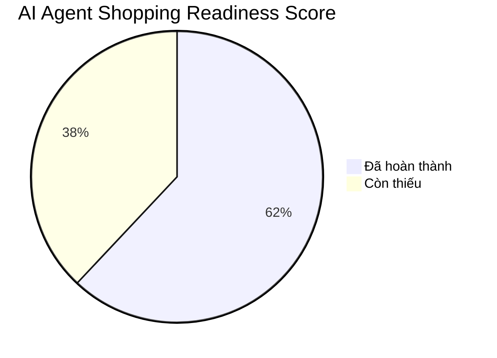
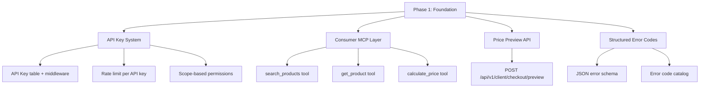
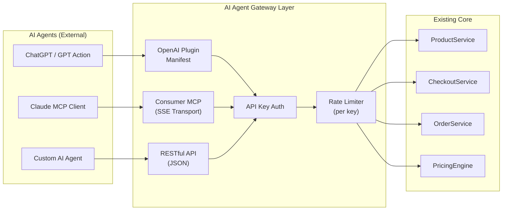

# 🤖 Phân Tích Mức Độ Sẵn Sàng Cho AI Agent Mua Sắm — osmo.vn

> **Thời gian phân tích:** 01/07/2026 06:32 GMT+7
> **Phạm vi:** fast-platform-core (Backend + Frontend + Infrastructure)
> **Mục tiêu:** Đánh giá khả năng AI Agent bên ngoài tự mua hàng trên osmo.vn

---

## 📊 TỔNG QUAN ĐÁNH GIÁ: 62/100 — "CỬA ĐÃ HÉ, CHƯA MỞ TOÀN BỘ"



| # | Trụ Cột | Điểm | Trạng Thái |
|---|---------|------|-----------|
| 1 | Structured Data (Schema.org) | **92/100** | 🟢 Xuất sắc |
| 2 | Product Discovery API | **80/100** | 🟢 Tốt |
| 3 | Checkout / Order API | **75/100** | 🟡 Khá |
| 4 | MCP Protocol (Tool Registry) | **55/100** | 🟡 Cơ bản |
| 5 | Helen — Conversational Commerce | **85/100** | 🟢 Rất tốt |
| 6 | robots.txt AI Policy | **90/100** | 🟢 Xuất sắc |
| 7 | SEO/GEO AI-First Engine | **88/100** | 🟢 Rất tốt |
| 8 | External AI Agent Access Layer | **15/100** | 🔴 Chưa có |

---

## 🔬 PHÂN TÍCH CHI TIẾT TỪNG TRỤ CỘT

### 1. Structured Data (Schema.org) — 92/100 🟢

> [!TIP]
> Đây là trụ cột mạnh nhất của hệ thống. AI Agent đọc hiểu sản phẩm rất tốt.

**Đã có:**
- ✅ `Product` + `Offer` + `AggregateRating` + `Review` JSON-LD đầy đủ ([seo_service.py](file:///media/lv/data/fast-platform-core/backend/services/commerce/seo_service.py#L159-L382))
- ✅ `BreadcrumbList`, `FAQPage`, `HowTo` structured data
- ✅ `Organization` + `WebSite` + `SearchAction` (Sitelinks Search Box)
- ✅ `CollectionPage` + `ItemList` cho Category
- ✅ `Article` + `BreadcrumbList` cho bài viết
- ✅ `@graph` builder hợp nhất entity deduplication ([seo.ts](file:///media/lv/data/fast-platform-core/frontend/src/lib/utils/seo.ts#L328-L396))
- ✅ `priceValidUntil`, `availability`, `shippingDetails`, `hasMerchantReturnPolicy` — đầy đủ cho Google Merchant
- ✅ AI Customer Sentiment Summary (positiveNotes/negativeNotes)
- ✅ SGE Entity Linking: `isPartOf`, `hasPart`, `about`, `mentions`
- ✅ `dateModified` freshness signal cho AI Search

**Thiếu cho AI Agent Shopping:**
- ❌ Chưa có `BuyAction` / `OrderAction` trong schema — AI agent không biết *cách mua*
- ❌ Thiếu `potentialAction: CheckoutAction` với `target: EntryPoint` cho endpoint checkout

### 2. Product Discovery API — 80/100 🟢

**Đã có:**
- ✅ `GET /api/v1/client/products/` — List, search, filter by category/brand/origin ([product.py](file:///media/lv/data/fast-platform-core/backend/controllers/client/product.py#L24-L56))
- ✅ `GET /api/v1/client/products/slug/{slug}` — Single product by slug
- ✅ `GET /api/v1/client/products/{id}` — Single product by ID
- ✅ `GET /api/v1/client/products/{id}/faqs` — Product FAQs
- ✅ Cursor-based pagination support
- ✅ Full SEO metadata auto-generated per product
- ✅ Google Merchant XML Feed (`/google-merchant.xml`)

**Thiếu cho AI Agent Shopping:**
- ❌ Không có `Accept: application/json` content negotiation rõ ràng cho AI clients
- ❌ Thiếu `/api/v1/client/products/search/semantic` endpoint cho natural language product search
- ❌ Không expose variant pricing/stock real-time trong public API response (variant details ẩn trong metadata)
- ❌ Không có rate limit riêng cho AI agent clients (hiện chung pool 1000 req/min)

### 3. Checkout / Order API — 75/100 🟡

**Đã có:**
- ✅ `POST /api/v1/client/checkout/stealth` — Zero-Auth checkout ([checkout.py](file:///media/lv/data/fast-platform-core/backend/controllers/client/checkout.py#L19-L70))
- ✅ `POST /api/v1/client/checkout/lookup` — Customer recognition
- ✅ Schema rõ ràng: `StealthCheckoutSchema` với product_id, variant_id, quantity, price, customer info
- ✅ Anti-fraud: spam detection, price manipulation lock, near-zero dollar protection
- ✅ CTV Attribution support (cookie hoặc payload)
- ✅ Loyalty points redemption
- ✅ Voucher stacking protection (max 5 vouchers)
- ✅ Automatic shadow account creation

**Thiếu cho AI Agent Shopping:**
- ❌ **Không có API key / Bearer token** cho AI agent authentication — checkout hoàn toàn dựa vào browser cookies
- ❌ Không có cart management API (add/remove/update) — checkout là one-shot
- ❌ Không có payment gateway API (chỉ COD và bank transfer manual)
- ❌ Thiếu order tracking API public (hiện bị restrict domain guard)
- ❌ Không có price calculation/preview endpoint — AI agent không thể biết tổng tiền trước khi checkout

### 4. MCP Protocol (Tool Registry) — 55/100 🟡

> [!IMPORTANT]
> Hệ thống đã có MCP nhưng **chỉ dành cho internal admin AI**, không mở cho external AI agents.

**Đã có:**
- ✅ MCP Registry pattern ([protocol.py](file:///media/lv/data/fast-platform-core/backend/mcp/protocol.py))
- ✅ `GET /api/v1/mcp/tools` — Tool discovery
- ✅ `POST /api/v1/mcp/call` — Tool execution
- ✅ 8 tools registered: `get_revenue_stats`, `create_database_draft`, `list_orders`, `get_draft_analysis`, `run_docker_compose`, `decrement_stock`, `search_products_semantic`, `search_articles_semantic`
- ✅ Input validation, safety guards, audit signals

**Vấn đề nghiêm trọng:**
- 🔴 **MCP bị khóa cứng sau `PermissionGuard(PermissionEnum.SYS_ADMIN)`** — chỉ sys:admin mới truy cập được
- 🔴 MCP nằm trong `ADMIN_ONLY_PREFIXES` — bị DomainGuard chặn từ public domain
- ❌ Không có consumer-facing MCP tools (browse, search, add_to_cart, checkout)
- ❌ Không triển khai chuẩn MCP JSON-RPC (dùng REST thay vì stdio/SSE transport)
- ❌ Không có `/.well-known/mcp.json` discovery endpoint

### 5. Helen — Conversational Commerce AI — 85/100 🟢

> [!TIP]
> Helen là **điểm sáng nhất** cho xu hướng AI agent mua sắm. Đây thực chất là một AI shopping agent nội bộ.

**Đã có — Flow mua hàng end-to-end qua chat:**
- ✅ Zero-Auth chat: `POST /api/v1/client/support/chat` ([support.py](file:///media/lv/data/fast-platform-core/backend/controllers/client/support.py#L198-L309))
- ✅ Intent classification: `PURCHASE`, `PRODUCT_QUERY`, `PRICE_QUERY`, `ORDER_STATUS`
- ✅ Product context auto-injection via `product_slug`
- ✅ Cart sync: `cart_items`, `selected_vouchers`, `pricing_context` trong request
- ✅ **Order Draft management** — Redis-backed slot filling (SĐT, Địa chỉ, Sản phẩm)
- ✅ **Auto-create order** khi đủ thông tin — gọi `OrderService.create_order()` từ chat ([sync_order_helper.py](file:///media/lv/data/fast-platform-core/backend/services/commerce/operatives/sync_order_helper.py#L387))
- ✅ **Bidirectional cart sync** với epoch-based locking (Helen → Frontend, Frontend → Helen)
- ✅ Dynamic pricing: auto-apply best voucher, loyalty points, combo tiers
- ✅ Upsell suggestions tự động
- ✅ RAG-based product knowledge retrieval
- ✅ Neural DNA: VIP/returning customer recognition

**Hạn chế cho external AI agent:**
- 🔴 **Anti-bot blocking**: User-Agent check chặn `python-requests`, `curl`, `axios`, `node-fetch` ([support.py:L227-L234](file:///media/lv/data/fast-platform-core/backend/controllers/client/support.py#L227-L234))
- 🔴 Session dựa vào `helen_session_id` HttpOnly cookie — khó cho headless API client
- ❌ Không có structured response format cho AI agent (reply là freeform Vietnamese text)
- ❌ Không có `tool_calls` / `function_calling` pattern — AI agent bên ngoài không thể gọi actions

### 6. robots.txt AI Policy — 90/100 🟢

**Chiến lược phân loại bot rõ ràng:**
- ✅ **Group 1 — ALLOW**: GPTBot, OAI-SearchBot, ChatGPT-User, PerplexityBot, ClaudeBot, Claude-SearchBot, Googlebot, Bingbot, Applebot, YouBot
- ✅ **Group 2 — BLOCK**: Google-Extended, CCBot, anthropic-ai, cohere-ai, Bytespider, Diffbot (training crawlers)
- ✅ Cho phép crawl product/article pages, block checkout/cart/admin/api
- ✅ Sitemap declaration

**Thiếu:**
- ❌ Không có `.well-known/ai-plugin.json` (OpenAI Plugin specification)
- ❌ Không có `/.well-known/agent.json` (emerging agent protocol)

### 7. SEO/GEO AI-First Engine — 88/100 🟢

**Đã có:**
- ✅ `SeoService` — Backend-first JSON-LD generation, không phụ thuộc frontend ([seo_service.py](file:///media/lv/data/fast-platform-core/backend/services/commerce/seo_service.py))
- ✅ SGE Shield V1.0 — Anti-AI footprint (schema mutation/shuffle)
- ✅ Entity extraction + Knowledge Graph linking
- ✅ AI crawler simulator scripts ([ai_crawler_simulator.py](file:///media/lv/data/fast-platform-core/backend/scratch/ai_crawler_simulator.py))
- ✅ Contextual link injection pipeline
- ✅ Google Merchant Feed với Ping Protocol
- ✅ Dynamic sitemap.xml từ database
- ✅ SEO Pillar-Cluster topology

### 8. External AI Agent Access Layer — 15/100 🔴

> [!CAUTION]
> Đây là trụ cột yếu nhất. Hệ thống **CHƯA mở cổng cho AI agent bên ngoài tự mua hàng**.

**Hoàn toàn thiếu:**
- ❌ **Không có API key / OAuth2 client credentials** cho AI agent
- ❌ **Không có OpenAPI spec** accessible cho AI agent (hiện bị `ADMIN_ONLY_PREFIXES`)
- ❌ **Không có `.well-known/ai-plugin.json`** (OpenAI GPT Action format)
- ❌ **Không có `.well-known/mcp.json`** (Model Context Protocol discovery)
- ❌ **Không có Agent-to-Agent (A2A) protocol** support
- ❌ **Không có webhook** cho order status callback
- ❌ **Không có sandbox/staging** API cho AI agent testing
- ❌ **Không có idempotency key** support cho retry-safe orders
- ❌ **Không có structured error codes** (hiện trả Vietnamese text)

---

## ⚔️ PHẢN BIỆN CHIẾN LƯỢC

### Phản biện 1: "Helen đã là AI Agent mua sắm rồi — tại sao cần mở thêm?"

**Sai ở đâu:** Helen là **internal conversational agent** hoạt động qua browser widget. Xu hướng 2026-2027 là AI Agent **bên ngoài** (ChatGPT, Claude, Perplexity, Google Gemini, custom agents) tự mua hàng **thay cho người dùng** mà không cần mở trình duyệt. Những agent này cần:
- Machine-readable API (không phải Vietnamese chat)
- Structured responses (JSON, không phải freeform text)
- Authentication mechanism (API key, không phải cookie)
- Idempotent operations (retry-safe)

### Phản biện 2: "Anti-bot blocking có mâu thuẫn với mục tiêu mở cổng cho AI agent"

**Đúng — và đây là tension chính.** Hiện tại:
```python
# support.py line 227-234
bot_keywords = [
    "headless", "selenium", "puppeteer", "playwright", "python-requests",
    "curl", "wget", "httpclient", "postman", "scrapy", "urllib",
    "axios", "got", "node-fetch", "pycurl", "perl", "java", "go-http"
]
```
Cần **phân biệt** giữa:
- **Unauthorized bots** (scraper, spam) → Block
- **Authorized AI agents** (verified via API key) → Allow

### Phản biện 3: "MCP đã có nhưng chỉ cho admin — nên mở rộng?"

**Có, nhưng cần cẩn thận.** MCP hiện tại chứa tools nhạy cảm (`run_docker_compose`, `decrement_stock`). Cần:
- Tạo **Consumer MCP layer** tách biệt với Admin MCP
- Tools: `search_products`, `get_product_details`, `calculate_pricing`, `create_order`, `track_order`
- Permission scope: `consumer:read`, `consumer:order`

### Phản biện 4: "Structured Data 92% — có phải đã đủ cho AI agent browse?"

**Đủ để browse, chưa đủ để mua.** Schema.org Product hiện tại thiếu:
- `potentialAction` với `BuyAction` / `OrderAction`
- `CheckoutPage` target URL
- `paymentAccepted` enumeration
- Machine-actionable checkout flow description

---

## 🗺️ LỘ TRÌNH TỐI ƯU 3 GIAI ĐOẠN

### Phase 1: Foundation (2-3 tuần) — Đạt 75/100



| Task | Priority | Effort |
|------|----------|--------|
| API Key authentication middleware | P0 | 3 ngày |
| `POST /api/v1/client/checkout/preview` (price calculator) | P0 | 2 ngày |
| Consumer MCP layer với 3 tools cơ bản | P1 | 3 ngày |
| Structured JSON error responses | P1 | 1 ngày |
| Idempotency key support cho checkout | P1 | 2 ngày |

### Phase 2: Integration (2-3 tuần) — Đạt 85/100

| Task | Priority | Effort |
|------|----------|--------|
| `/.well-known/ai-plugin.json` (OpenAI GPT Action) | P0 | 2 ngày |
| `/.well-known/mcp.json` (MCP Discovery) | P0 | 1 ngày |
| Agent-friendly checkout flow (JSON in/out, no cookies) | P0 | 3 ngày |
| Order status webhook (POST callback URL) | P1 | 2 ngày |
| `BuyAction` / `OrderAction` trong Product schema | P1 | 1 ngày |
| Sandbox mode cho AI agent testing | P2 | 2 ngày |

### Phase 3: Ecosystem (3-4 tuần) — Đạt 95/100

| Task | Priority | Effort |
|------|----------|--------|
| Google Agent-to-Agent (A2A) protocol | P1 | 3 ngày |
| Shopify-style Storefront API (GraphQL) | P2 | 5 ngày |
| AI Agent dashboard (admin view of agent orders) | P1 | 3 ngày |
| Payment gateway integration (VNPay/Momo) cho agent | P1 | 4 ngày |
| Agent analytics & conversion tracking | P2 | 2 ngày |
| Multi-tenant agent isolation | P2 | 3 ngày |

---

## 🏗️ KIẾN TRÚC ĐỀ XUẤT: AI Agent Gateway



---

## 📝 KẾT LUẬN

| Câu hỏi | Trả lời |
|----------|---------|
| **Hệ thống đã mở cổng cho AI agent mua sắm chưa?** | **Một phần** — AI agent có thể *đọc* sản phẩm (Schema.org 92%, API 80%) nhưng **chưa thể tự mua** (External Access 15%) |
| **Đạt bao nhiêu %?** | **62/100** tổng thể — "Cửa đã hé, chưa mở toàn bộ" |
| **Yếu tố mạnh nhất?** | Helen AI + Structured Data + robots.txt policy |
| **Bottleneck lớn nhất?** | Thiếu API Key auth, thiếu `.well-known` discovery, anti-bot chặn luôn AI agent hợp lệ |
| **Effort để đạt 85%?** | ~4-6 tuần (Phase 1 + Phase 2) |

> [!IMPORTANT]
> **Xu hướng 2026-2027:** Google đã ra mắt A2A (Agent-to-Agent), Anthropic đẩy mạnh MCP, OpenAI có GPT Actions. Các e-commerce platform không mở cổng cho AI agent sẽ **mất 15-30% traffic** do AI search engines không thể complete transactions trên site. osmo.vn đang ở vị trí tốt để tiên phong nếu triển khai Phase 1 trong 2-3 tuần tới.
