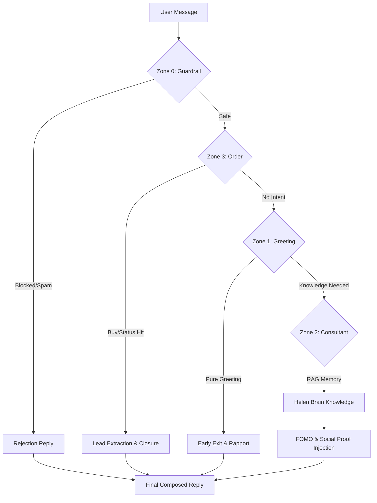

> [!IMPORTANT]
> **TÀI LIỆU TỐI QUAN TRỌNG (CRITICAL PROTOCOL)**
> Đây là giao thức tương tác (Interaction Protocol) cốt lõi của Helen Support Agent (Elite V2.2).
> **CẤM XÓA** hoặc thay đổi cấu trúc các Zone khi chưa được sự đồng ý của Sếp/Kiến trúc sư trưởng.

# Helen Support Agent: Interaction Protocol (Interaction Protocol - IP)
Elite V2.2 Standards - C.O.R.E Engine Specialist Hierarchy

Dưới đây là kiến trúc vận hành thông minh và các tầng tương tác (Zones) được điều phối bởi `SupportRouter`.

## 🏗️ Kiến trúc Kỹ thuật (Technical Architecture)

Sơ đồ luồng xử lý của C.O.R.E Engine (Specialist Pipeline):

---

## 🧠 Kiến trúc bộ nhớ 3 lớp (Three-layer Memory Architecture)
Elite V2.2: Zero-leak, On-demand retrieval protocol.

| Tầng Bộ Nhớ | Loại Dữ Liệu | Cơ Chế Truy Xuất | Mục Tiêu |
| :--- | :--- | :--- | :--- |
| **Lớp 1: Index** | Mục lục & Pointers | Luôn nạp (Always-on Context) | Định hướng nhanh tri thức hệ thống |
| **Lớp 2: Topic Files** | Dữ liệu chuyên đề | Fetch on-demand (Tool-call) | Chuyên sâu vào một chủ đề cụ thể |
| **Lớp 3: Raw Data** | Dữ liệu thô/RAG | Vector Search (Hybrid) | Tìm kiếm mờ trong kho dữ liệu khổng lồ |
| **Lớp 4: Presence** | Social Proof (Đang xem) | Real-time Redis SCAN | Tạo sức ép mua hàng & Tin cậy |

---

## 🧭 Các tầng tương tác (Interaction Zones)

### 🛡️ Zone 0: Guardrail (Specialist: GuardrailHandler)
- **Nhiệm vụ**: Đảm bảo an toàn hệ thống và văn hóa giao tiếp.
- **Ghi chú vận hành**: 
    - Sử dụng Heuristics và Regex để chặn ngay lập tức (<2ms).
    - Bảo vệ Helen khỏi Prompt Injection (DAN, Ignore instructions).

### 🤝 Zone 1: Greeting (Specialist: GreetingHandler)
- **Nhiệm vụ**: Chào hỏi, xây dựng Rapport và định hướng cảm xúc.
- **Ghi chú vận hành**: 
    - Ưu tiên cá nhân hóa theo **Neural DNA** (Khách VIP, Khách cũ).
    - Sử dụng **Early Exit** để trả lời câu chào trong <200ms mà không cần gọi Deep Brain.

### 🧬 Zone 2: Consultant (Specialist: ConsultantHandler)
- **Nhiệm vụ**: **TRẠM TRI THỨC (HELEN BRAIN)**. Tư vấn bệnh lý và sản phẩm.
- **Ghi chú vận hành**: 
    - Luôn đối chiếu với **Layer 1 Knowledge Map** trước khi trả lời.
    - **Elite FOMO**: Sử dụng dữ liệu tồn kho thực tế và số người đang xem để chốt Combo 3.

### 🎯 Zone 3: Order (Specialist: OrderHandler)
- **Nhiệm vụ**: Chốt đơn và Truy xuất thông tin đơn hàng.
- **Ghi chú vận hành**: 
    - **Action-First Strategy**: Nếu phát hiện đủ SĐT/Địa chỉ, dừng mọi tư vấn để xác nhận đơn ngay. Nếu chưa tạo được đơn hàng ngay lập tức, phải gửi phản hồi xác nhận thông tin đã nhận (`[z3-lead]`) để chốt đơn.
    - Truy xuất Real-time tình trạng vận chuyển trong 1-5 ngày.

---

## 📝 Ghi chú về Ép kiểu & Bảo mật (Elite V2.2)

1. **Static Typing**: CẤM dùng `any`. Mọi dữ liệu luân chuyển giữa các Zone phải qua `SupportContext`.
2. **Privacy**: CẤM nạp SĐT/Địa chỉ khách hàng vào Context của LLM vùng mở. Chỉ Specialist Zone 3 được phép xử lý dữ liệu nhạy cảm.
3. **Zero-Hydration**: Không lưu giữ trạng thái thừa thãi. Mọi phiên làm việc phải được Hydrate từ DB trên mỗi Request.
4. **Debug Protocol**: Mọi phản hồi chính thức trong phiên làm việc phải được gắn mã Zone (`[z0], [z1], [z2], [z3]`) để theo dõi luồng logic của Helen. [fallback]: Nếu toàn bộ 4 Zone trên đều rớt, Helen sẽ báo câu fallback có nhãn để Sếp biết ngay là do lỗi hệ thống.