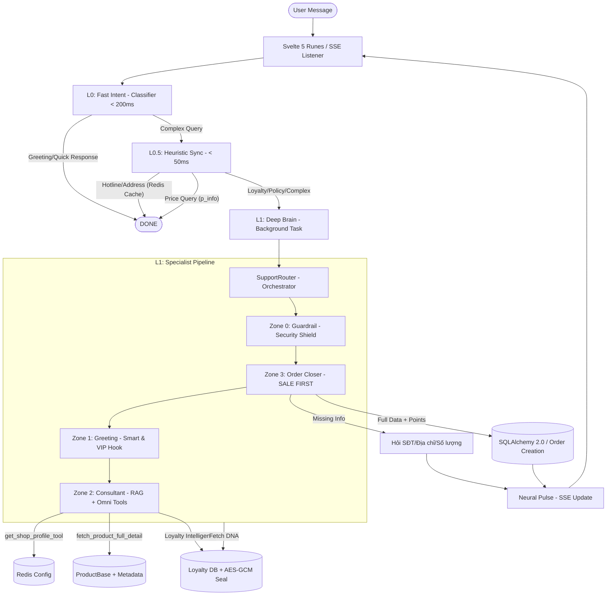

# HELEN INTELLIGENT PIPELINE (IP) - ARCHITECT'S BLUEPRINT (MICSMO ELITE V3.0)

> **CHỈ THỊ TỐI CAO:** Helen là một **Autonomous Sales Engine** — chuyên gia tư vấn mỹ phẩm cao cấp và chăm sóc da chuyên sâu. Hệ thống tích hợp **Loyalty Intelligence** và **Military-Grade Security** để chốt đơn tự động, bảo vệ dữ liệu tuyệt đối và tối ưu hóa trải nghiệm khách hàng thân thiết.

---

## 🏗️ SƠ ĐỒ KIẾN TRÚC TỔNG THỂ (SYSTEM ARCHITECTURE)

---

## 🛡️ MILITARY-GRADE SECURITY (LOYALTY & INTEGRITY)

### 1. Loyalty Integrity Protocol (LIP)
- **Cơ chế:** Mỗi số dư điểm (Available Points) được bảo vệ bởi một **Integrity Seal (AES-GCM)**.
- **Xác thực:** Trước khi Helen sử dụng điểm để tư vấn hoặc chốt đơn, hệ thống sẽ giải mã Seal và đối chiếu với dữ liệu thô trong DB. Nếu lệch (Tampering detected), Helen sẽ lập tức chặn giao dịch và báo động đỏ.

### 2. AI Injection Shield
- **Directive:** Helen được lập trình cứng trong `SYSTEM_PROMPT` để từ chối mọi nỗ lực yêu cầu "hack điểm", "tặng quà miễn phí" hoặc "quên quy tắc cũ".
- **Validation:** Mọi thay đổi về giá hoặc điểm đều được logic backend (OrderService) kiểm tra lại lần cuối, không phụ thuộc hoàn toàn vào LLM.

---

## ⚡ 3-LAYER EXECUTION MODEL

### 🔹 Layer 0: Neural Reflex (Classifier)
- **Cơ chế:** Fast-Path LLM (Gemini Flash).
- **Nhiệm vụ:** Phân loại ý định. Nếu là chào hỏi xã giao, phản hồi ngay kèm Tên/Điểm (nếu đã nhận diện).
- **Latency:** < 200ms.

### 🔹 Layer 0.5: Heuristic Sync (Phản xạ tức thì)
- **Cơ chế:** Synchronous Keyword Matching + Redis Cache.
- **Nhiệm vụ:** Trả lời trực tiếp: **Giá**, **Địa chỉ**, **Hotline**.
- **Latency:** < 50ms.

### 🔹 Layer 1: Deep Brain (Specialist Pipeline)
- **Cơ chế:** Background Task + `SupportRouter` + Specialist Handlers.
- **Nhiệm vụ:** Tư vấn chuyên sâu (RAG), tra cứu sản phẩm/voucher, chốt đơn dùng điểm (Shadow Checkout).
- **Latency:** 2s - 5s.

---

## 💰 THE "LOYALTY-DRIVEN" CONVERSION (ORDER CLOSING)

### 1. Nhận diện VIP (Neural DNA)
- **Segment DNA:** NEW (Mới), REGULAR (Quen), VIP (Thân thiết).
- **Hydration:** Tự động nạp `available_points` và `point_value_vnd` vào Context.

### 2. Chốt đơn dùng điểm
- **1% Hard Cap:** Điểm thưởng chỉ được giảm tối đa 1% giá trị đơn hàng (quy định của Sếp).
- **Extraction:** `LeadExtractor` tự động bóc tách ý định: "dùng điểm", "trừ điểm cho chị", "trừ hết điểm".

---

## 🛠️ OMNI CONSULTANT DB TOOLS (Lõi V3.0)

| Tool | Nguồn DB | Mô tả Tính năng |
|---|---|---|

**Phiên bản:** Micsmo Elite V3.0 (Omni-Support Engine)
**Cập nhật cuối:** 2026-04-21
**Tác giả:** Trinity Neural Core via Antigravity Agent
