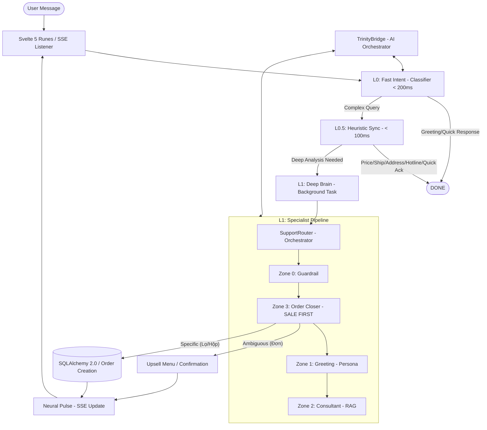

# HELEN INTELLIGENT PIPELINE (IP) - ARCHITECT'S BLUEPRINT (ELITE V2.5)

> **CHỈ THỊ TỐI CAO:** Helen không chỉ là Chatbot, Helen là một **Autonomous Sales Engine**. Hệ thống được thiết kế để chốt đơn thần tốc, tối ưu hóa RAM (4GB) và duy trì tỷ lệ chuyển đổi (CR) cao nhất thông qua Specialist Pipeline.

---

## 🏗️ SƠ ĐỒ KIẾN TRÚC TỔNG THỂ (SYSTEM ARCHITECTURE)

---

## ⚡ 3-LAYER EXECUTION MODEL

Hệ thống điều phối xử lý theo 3 tầng chiến thuật để đảm bảo trải nghiệm "thực" và tốc độ phản hồi kinh ngạc.

### 🔹 Layer 0: Neural Reflex (Classifier)
- **Cơ chế:** Fast-Path LLM (Gemini Flash).
- **Nhiệm vụ:** Phân loại ý định ngay lập tức. Nếu là chào hỏi xã giao, phản hồi ngay để giữ chân khách.
- **Latency:** < 200ms.

### 🔹 Layer 0.5: Heuristic Sync (Phản xạ tức thì)
- **Cơ chế:** Synchronous Keyword Matching + Context Awareness (Bypass LLM).
- **Nhiệm vụ:** Trả lời các câu hỏi về **Giá**, **Phí ship**, **Địa chỉ**, **Hotline**.
- **Điểm đặc biệt:** Tự động lấy giá thực tế từ `ProductBase` trong DB theo Context trang sản phẩm để báo giá chính xác 100%.
- **Latency:** < 100ms.

### 🔹 Layer 1: Deep Brain (Specialist Pipeline)
- **Cơ chế:** Background Task + `SupportRouter` điều phối các Specialist Handlers.
- **Nhiệm vụ:** Xử lý các câu hỏi bệnh lý phức tạp, tư vấn liệu trình, so sánh sản phẩm (RAG) và bóc tách đơn hàng.
- **Latency:** 2s - 5s (Phản hồi qua SSE Neural Pulse).

---

## 💰 THE "CONVERSION-FIRST" PROTOCOL (ORDER CLOSING)

Đây là trái tim của Helen, được thiết kế để "bắt bài" mọi tín hiệu chốt đơn của khách hàng.

### 1. Phân biệt Ý định Chốt đơn (Specific vs Ambiguous)
Dựa trên thực tế code tại `OrderHandler.py`, Helen phân biệt hai loại tín hiệu:
- **Tín hiệu "Lọ/Hộp/Chai" (Confirmed Unit):** 
    - *Input:* "Cho 1 lọ về địa chỉ..."
    - *Xử lý:* Lên đơn ngay lập tức.
    - *Phản hồi:* Chúc mừng thành công + Mã đơn + Link theo dõi.
- **Tín hiệu "Đơn" (Ambiguous Quantity):** 
    - *Input:* "Cho 1 đơn về địa chỉ..."
    - *Xử lý:* Ghi nhận thông tin Lead (SĐT/Địa chỉ) nhưng dừng lại ở bước xác nhận số lượng.
    - *Phản hồi:* Kích hoạt **Menu Upsell** (Combo 2 tặng 1, Combo 4 tặng 1) để tối ưu AOV.

### 2. Lead Extraction (PydanticAI)
Sử dụng `lead_extractor` để bóc tách thông tin nguyên tử từ câu chat tự nhiên:
- **LeadPhone:** Tự động nhận diện định dạng SĐT Việt Nam.
- **LeadAddress:** Bóc tách địa chỉ chi tiết, tỉnh thành.
- **Neural DNA:** Ghi nhớ khách là VIP hay khách mới để điều chỉnh phong thái phục vụ.

---

## 🛡️ CÁC ZONE CHIẾN THUẬT (SPECIALIST ZONES)

- **Zone 0 (Guardrail):** Chặn các câu hỏi nhạy cảm, chính trị hoặc đối thủ cạnh tranh.
- **Zone 1 (Greeting):** Xây dựng lòng tin, sử dụng Social Proof (số người đang xem) để tạo hiệu ứng FOMO.
- **Zone 2 (Consultant):** Sử dụng RAG để tư vấn kiến thức sản phẩm chuyên sâu (thành phần, công dụng).
- **Zone 3 (Order):** Đảm nhận vai trò "Sát thủ chốt đơn", ưu tiên cao nhất trong Pipeline.

---

## 🚫 TIÊU CHUẨN KỸ THUẬT (ENGINEERING STANDARDS)

1. **TrinityBridge Only:** Mọi lượt gọi AI phải qua Bridge để quản lý **Key Rotation** (8 keys) và **Concurrency Guard** (Semaphore 4) để bảo vệ CPU.
2. **Context Persistence:** Lịch sử hội thoại được lấy **10 tin nhắn** gần nhất để đảm bảo ngữ cảnh tư vấn sâu.
3. **Zero Leak:** Mọi thông tin nhạy cảm của khách (SĐT, Địa chỉ) được mã hóa (AES-256) trước khi lưu vào Database qua `GeminiSecurity`.
4. **SSE Flow:** Tuyệt đối tuân thủ luồng SSE để hiển thị trạng thái "Helen đang suy nghĩ..." giúp khách hàng không cảm thấy bị bỏ rơi.

---

**Phiên bản:** Elite V2.5  
**Cập nhật cuối:** 2026-04-08  
**Tác giả:** Trinity Neural Core via Claude Agent
