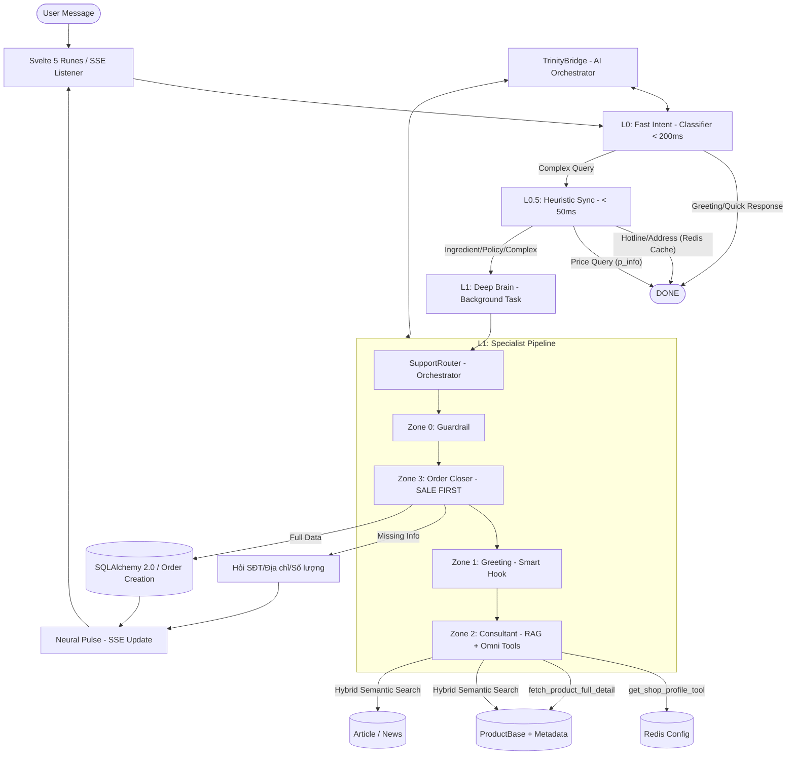

# HELEN INTELLIGENT PIPELINE (IP) - ARCHITECT'S BLUEPRINT (MICSMO ELITE V3.0)

> **CHỈ THỊ TỐI CAO:** Helen là một **Autonomous Sales Engine** — chuyên gia tư vấn mỹ phẩm cao cấp và chăm sóc da chuyên sâu cho toàn sàn **Micsmo.com**. Hệ thống được thiết kế để chốt đơn thần tốc, tối ưu hóa RAM (2-4GB) và duy trì tỷ lệ chuyển đổi (CR) cao nhất thông qua Specialist Pipeline + 6 DB Tools.

---

## 🏗️ SƠ ĐỒ KIẾN TRÚC TỔNG THỂ (SYSTEM ARCHITECTURE)

---

## ⚡ 3-LAYER EXECUTION MODEL

### 🔹 Layer 0: Neural Reflex (Classifier)
- **Cơ chế:** Fast-Path LLM (Gemini Flash).
- **Nhiệm vụ:** Phân loại ý định ngay lập tức. Nếu là chào hỏi xã giao, phản hồi ngay.
- **Latency:** < 200ms.

### 🔹 Layer 0.5: Heuristic Sync (Phản xạ tức thì)
- **Cơ chế:** Synchronous Keyword Matching + Redis Cache (Bypass AI & Database).
- **Nhiệm vụ:** Trả lời trực tiếp: **Giá**, **Địa chỉ**, **Hotline**. Rớt truy vấn **Thành phần/Vận chuyển** thẳng sang LLM chuyên sâu.
- **Điểm đặc biệt:** Đọc `system:settings:primary_config` ở RAM qua mức ~50ms.
- **Latency:** < 50ms.

### 🔹 Layer 1: Deep Brain (Specialist Pipeline)
- **Cơ chế:** Background Task + `SupportRouter` điều phối Specialist Handlers.
- **Nhiệm vụ:** Tư vấn chuyên sâu (RAG), tra cứu sản phẩm/voucher/bài viết, chốt đơn.
- **Latency:** 2s - 5s (SSE Neural Pulse).

---

## 💰 THE "CONVERSION-FIRST" PROTOCOL (ORDER CLOSING)

### 1. Phân biệt Ý định Chốt đơn
- **Tín hiệu "Lọ/Hộp/Chai/..." (Confirmed Unit):**
    - *Input:* "Cho 1 hộp về địa chỉ..."
    - *Xử lý:* Lên đơn ngay lập tức.
    - *Phản hồi:* Chúc mừng + Mã đơn + Link theo dõi.
- **Tín hiệu "Đơn" (Ambiguous Quantity):**
    - *Input:* "Cho 1 đơn về địa chỉ..."
    - *Xử lý:* Ghi nhận Lead (SĐT/Địa chỉ), hỏi xác nhận số lượng + giá dynamic từ DB.

### 2. Lead Extraction (PydanticAI)
- **LeadPhone:** Nhận diện SĐT Việt Nam.
- **LeadAddress:** Bóc tách địa chỉ chi tiết, tỉnh thành, resolve multi-province.
- **Neural DNA:** VIP / REGULAR / NEW → điều chỉnh phong thái phục vụ.

---

## 🛡️ CÁC ZONE CHIẾN THUẬT

| Zone | Handler | Nhiệm vụ |
|---|---|---|
| 0 | Guardrail | Chặn nội dung nhạy cảm, đối thủ, prompt injection |
| 1 | Greeting | Xây dựng lòng tin, Smart Hook gợi mở sản phẩm/khuyến mãi |
| 2 | Consultant | RAG + Omni Tools (Product/Settings/Voucher/Article/KB) |
| 3 | Order | Sát thủ chốt đơn, ưu tiên cao nhất |

## 🛠️ OMNI CONSULTANT DB TOOLS (Lõi V3.0)

| Tool | Nguồn DB | Mô tả Tính năng |
|---|---|---|
| `get_shop_profile_tool` | `Redis Cache` | Lấy giờ hoạt động, Zalo, địa chỉ chính thức (Thay thế KB cũ). |
| `fetch_product_full_detail` | `ProductBase` | Khai thác Product Description (HTML stripped) + `product_metadata` để lấy thành phần/cách dùng. |
| `search_products_tool` | `ProductBase` | **Hybrid Search**: Semantic Vector Search + Keyword Fallback max 5 sản phẩm. |
| `search_articles_tool` | `Article` | **Hybrid Search**: Semantic Vector Search + Keyword Fallback bài viết chính sách. |
| `get_active_promotions_tool` | `Voucher` + `Combo` | Lấy danh sách khuyến mãi đang chạy. |
| `search_knowledge_base` | `SupportKnowledge` | RAG fallback cuối cùng nếu câu hỏi không thuộc các luồng trên. |

---

## 🚫 TIÊU CHUẨN KỸ THUẬT

1. **TrinityBridge Only:** Mọi lượt gọi AI qua Bridge (Key Rotation 8 keys, Semaphore 4).
2. **Context Persistence:** 10 tin nhắn gần nhất. Giới hạn 5000 ký tự (Đã chống tràn memory).
3. **Zero Leak:** AES-256 cho SĐT/Địa chỉ.
4. **SSE Flow:** "Helen đang suy nghĩ..." realtime.
5. **FOMO Guard:** Chỉ inject [TỒN KHO]/[ĐANG XEM] khi có data thật.
6. **Tenant-Aware:** Mọi DB tool filter theo `current_tenant_id` và có tích hợp Vector Fallback.

---

**Phiên bản:** Micsmo Elite V3.0 (Omni-Support Engine)
**Cập nhật cuối:** 2026-04-21
**Tác giả:** Trinity Neural Core via Antigravity Agent
