# Báo Cáo Đánh Giá Kiến Trúc Cơ Sở Dữ Liệu Toàn Diện (Database Architecture Review)

Bản đánh giá này cung cấp cái nhìn tổng quan về thiết kế cơ sở dữ liệu vật lý hiện tại của hệ sinh thái **osmo.vn** (Fast Platform), biểu đồ quan hệ thực thể (ERD), cấu trúc index tối ưu hóa, và các đề xuất bảo trì lâu dài.

---

## 1. Biểu Đồ Quan Hệ Thực Thể (ERD Relationships)

Dưới đây là sơ đồ Mermaid mô tả các mối liên kết khóa ngoại (Foreign Keys) giữa các phân hệ cốt lõi trong cơ sở dữ liệu:

```mermaid
classDiagram
    %% Core User Domain
    users "1" --* user_roles : "has roles"
    roles "1" --* user_roles : "assigned to"
    roles "1" --* role_permissions : "contains"
    permissions "1" --* role_permissions : "linked to"

    %% E-commerce & Affiliate Domain
    users "1" --* orders : "places"
    users "1" --* user_loyalty : "tracks points"
    users "1" --* point_transactions : "earns/redeems"
    orders "1" --* point_transactions : "generates"
    commission_tiers "1" --* affiliate_profiles : "sets rates"
    users "1" --* affiliate_profiles : "profile of"
    affiliate_profiles "1" --* affiliate_profiles : "referred by"
    orders "1" --* commission_ledger : "calculates commission"
    affiliate_profiles "1" --* commission_ledger : "earns commission"
    affiliate_profiles "1" --* withdrawal_requests : "requests payout"
    users "1" --* withdrawal_requests : "payout approved by"

    %% Content & SEO Domain
    users "1" --* content_campaigns : "manages"
    users "1" --* articles : "author"
    categories "1" --* articles : "categorized under"
    categories "1" --* categories : "parent category"
    articles "1" --* article_embeddings : "vectorized in"
    articles "1" --* seo_contextual_links : "has links"
    seo_nodes "1" --* seo_contextual_links : "targets node"
    users "1" --* seo_contextual_links : "reviewed by"
    seo_nodes "1" --* seo_edges : "source node"
    seo_nodes "1" --* seo_edges : "target node"
    seo_nodes "1" --* seo_pillar_embeddings : "pillar vectorized"

    %% Product & Support Domain
    categories "1" --* product_bases : "grouped by"
    product_bases "1" --* product_variants : "has variations"
    product_bases "1" --* product_embeddings : "product vectorized"
    product_bases "1" --* support_knowledge : "knowledge base"
    support_knowledge "1" --* support_knowledge_embeddings : "KB vectorized"

    %% Media & Operations Domain
    users "1" --* media_registry : "uploaded by"
    content_campaigns "1" --* media_registry : "associated with"
    media_registry "1" --* media_usage : "used in"
    content_campaigns "1" --* appointments : "schedules"
    content_campaigns "1" --* campaign_events : "emits"
    product_bases "1" --* video_scripts : "promotes"
    users "1" --* video_scripts : "created by"
    video_script_styles "1" --* video_scripts : "styled with"
```



---

## 2. Chi Tiết Cấu Trúc Các Phân Hệ & Thiết Kế Chỉ Mục (Indexes)

Cơ sở dữ liệu được chia làm 5 phân hệ lớn, tất cả các bảng đều hỗ trợ Multi-tenant tách biệt qua trường `tenant_id`:

### Phân Hệ 1: User & Authorization (Thành viên & Phân quyền)
*   **users:** Bảng thông tin người dùng chính. Có các chỉ mục duy nhất trên `email` và `username`. Đặc biệt, có composite index duy nhất `ix_users_phone_tenant` trên `(tenant_id, phone, deleted_at)` hỗ trợ đăng nhập số điện thoại không trùng lặp theo từng tenant.
*   **roles & permissions:** Lưu trữ vai trò và quyền hạn.
*   **user_roles & role_permissions:** Bảng liên kết (junction tables) sử dụng khóa chính phức hợp (composite PK) trên cả 2 ID, loại bỏ sự cần thiết của index phụ.

### Phân Hệ 2: E-commerce, Loyalty & Affiliate (Thương mại & Cộng tác viên)
*   **orders:** Lưu trữ đơn hàng. Sử dụng composite index `ix_orders_tenant_deleted (tenant_id, deleted_at)` để truy vấn nhanh danh sách đơn hàng active của tenant. Các trường tìm kiếm khách hàng được đánh index đơn riêng biệt: `customer_name`, `customer_phone`.
*   **affiliate_profiles:** Thông tin tài khoản CTV. Liên kết với `commission_tiers` để tính hoa hồng. Có chỉ mục composite `ix_affiliate_profiles_tenant_deleted` quản lý tài khoản theo tenant.
*   **commission_ledger:** Sổ cái ghi nhận hoa hồng. Sử dụng composite index `ix_commission_ledger_tenant_status (tenant_id, status)` và `ix_commission_ledger_aff_status (affiliate_id, status)` để phục vụ việc đối soát và thanh toán định kỳ.
*   **user_loyalty & point_transactions:** Hệ thống tích lũy điểm thưởng. Có composite index `ix_point_tx_tenant_user_time (tenant_id, user_id, created_at)` tối ưu tuyệt đối cho màn hình hiển thị lịch sử nhận/tiêu điểm của thành viên theo thời gian thực.

### Phân Hệ 3: SEO & Content Management (Bài viết & Tối ưu SEO)
*   **articles:** Lưu trữ bài viết của blog/tin tức. Có các index hỗ trợ tìm kiếm qua `slug` và trạng thái `status`.
*   **seo_nodes & seo_edges:** Đồ thị liên kết thực thể SEO phục vụ AI. Sử dụng composite index `uq_seo_node_entity_tenant` trên `(entity_type, entity_id, tenant_id)` để tra cứu nhanh nút đồ thị tương ứng.
*   **seo_contextual_links:** Liên kết tự động giữa các bài viết dựa trên từ khóa ngữ cảnh. Có composite index `ix_seo_ctx_links_source_status` trên `(source_article_id, status)` giúp tối ưu hóa việc render danh sách link liên kết ở cuối bài viết.

### Phân Hệ 4: Product & Support (Sản phẩm & CSKH)
*   **product_bases & product_variants:** Quản lý sản phẩm thời trang/bán lẻ. `product_bases` có các composite index hỗ trợ tìm kiếm sản phẩm đang hoạt động: `ix_products_status_deleted (status, deleted_at)`.
*   **support_knowledge:** Cơ sở tri thức chatbot. Hỗ trợ index composite `ix_support_knowledge_tenant_active (tenant_id, is_active)`.

### Phân Hệ 5: Vector Embeddings (Lưu trữ Vector Nhị Phân)
Hệ thống sử dụng tiện ích mở rộng `pgvector` (đã nâng cấp lên bản `0.8.2` ổn định) để lưu trữ vector biểu diễn ngữ nghĩa:
*   `article_embeddings` (384 dims)
*   `seo_pillar_embeddings` (384 dims)
*   `product_embeddings` (384 dims)
*   `support_knowledge_embeddings` (384 dims)

---

## 3. Các Điểm Tối Ưu Hóa Trọng Yếu Đã Đạt Được (Lượt review này)

### A. Triệt tiêu rủi ro OOM & Cải thiện write performance
*   **Loại bỏ 49 indexes dư thừa:** Hầu hết các bảng trước đây bị đánh index đơn lẻ trên cột `tenant_id` và `deleted_at`, trong khi lại có sẵn composite index bắt đầu bằng `tenant_id` (như `(tenant_id, deleted_at)` hoặc `(tenant_id, status)`). Theo nguyên tắc B-Tree, các composite index này hoàn toàn đảm nhiệm tốt các truy vấn tìm kiếm lọc theo cột đầu tiên (`tenant_id`). Drop 49 index thừa giúp giảm tải ghi đĩa đáng kể mà không làm giảm tốc độ đọc.
*   **Dọn dẹp bộ nhớ đệm:** Giảm kích thước index trên RAM (shared buffers), tăng tỷ lệ trúng cache (Cache Hit Ratio).

### B. Chuyển đổi JSON sang JSONB toàn hệ thống
*   Đã chuyển đổi toàn bộ **31 cột raw text `json`** sang kiểu **`jsonb` nhị phân nén**.
*   **Hiệu quả:**
    1.  Tốc độ truy xuất nhanh hơn gấp nhiều lần vì Postgres lưu trữ dưới dạng cấu trúc nhị phân đã phân tích, không cần parse lại chuỗi string mỗi lần đọc.
    2.  Tiết kiệm dung lượng đĩa nhờ khả năng nén tự nhiên của JSONB.
    3.  Mã nguồn Python SQLAlchemy hoạt động đồng bộ hoàn toàn với kiểu khai báo cột nhị phân dưới cơ sở dữ liệu.

### C. Dọn dẹp khoảng trống đĩa (Physical Vacuuming)
*   Toàn bộ không gian đĩa vật lý của các index cũ đã được thu hồi thông qua lệnh `VACUUM ANALYZE`.
*   Tỷ lệ Dead Tuples trên toàn bộ cơ sở dữ liệu đã về mức **0.00%**.

---

## 4. Khuyến Nghị Vận Hành & Bảo Trì Định Kỳ (Maintenance Strategy)

Để hệ thống `osmo.vn` luôn hoạt động ở trạng thái tối ưu nhất khi lượng truy cập tăng cao, khuyến nghị triển khai:

1.  **Chính sách Auto-Vacuum định kỳ cho Bảng có tần suất ghi cao:**
    Thiết lập thông số auto-vacuum riêng biệt cho các bảng `system_reviews`, `media_registry` và `point_transactions` để dọn dẹp các dead tuples ngay lập tức khi chúng vượt quá 10% tổng số dòng:
    ```sql
    ALTER TABLE system_reviews SET (autovacuum_vacuum_scale_factor = 0.10);
    ```
2.  **Giám sát Vector Search:**
    Hiện tại, số lượng dòng trong các bảng embedding (`article_embeddings`, `product_embeddings`) còn nhỏ (< 1000 dòng), vì vậy PostgreSQL sẽ sử dụng phương thức Sequential Scan để tính khoảng cách cosine (`<=>`). Khi số lượng bài viết hoặc sản phẩm vượt quá **10,000 dòng**, cần tạo thêm chỉ mục HNSW (Hierarchical Navigable Small World) để tối ưu hóa thời gian tìm kiếm ngữ nghĩa xuống dưới 10ms:
    ```sql
    CREATE INDEX ix_articles_hnsw_idx ON article_embeddings USING hnsw (embedding vector_cosine_ops);
    ```
3.  **Tiến trình Lưu trữ Đa Phương Tiện (Media Offloading):**
    Di chuyển dần tệp tin ảnh tĩnh từ đĩa cục bộ của VPS `/opt/fast-platform/frontend/static/uploads/` sang dịch vụ lưu trữ ngoài (Cloudflare R2 hoặc S3-compatible) để tránh việc phình to kích thước đĩa ghi của hệ thống, giúp các transaction sao lưu cơ sở dữ liệu diễn ra nhanh chóng hơn.
