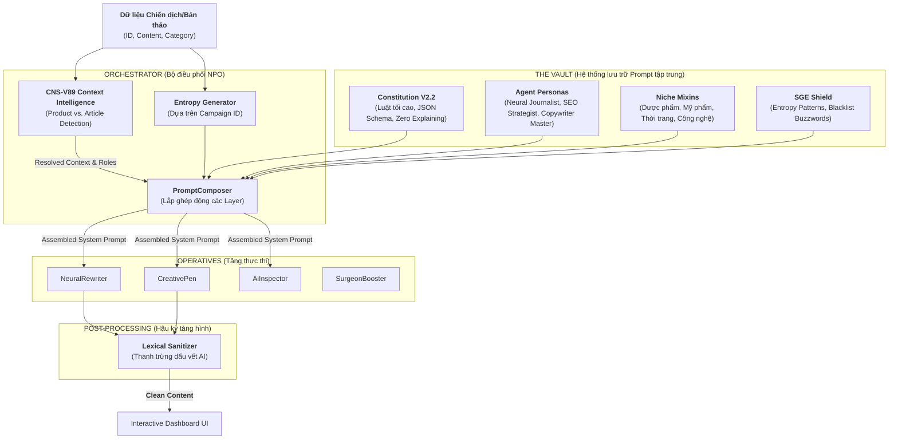

# NEURAL PROMPT ORCHESTRATION (NPO) V2.2 ARCHITECTURE

> Hệ thống điều phối "linh hồn" AI đa tầng, tối ưu hóa cho sự kế thừa, bảo mật và khả năng tàng hình tuyệt đối (SGE Shield).

## 1. Sơ đồ kiến trúc tổng thể (Neural Flow)

## 2. Các lớp thành phần (Layer Breakdown)

### A. Core Constitution (Lớp Hiến pháp)
- **Vị trí**: `backend/services/xohi/prompts/core/`
- **Nhiệm vụ**: Quy định các luật chơi "bất khả xâm phạm":
    - **Zero Explanation**: AI chỉ trả về dữ liệu (JSON/HTML), cấm giải thích "Dưới đây là bài viết của bạn...".
    - **Strict Schema**: Ép kiểu dữ liệu đầu ra 100%.
    - **Vietnamese Elite**: Sử dụng ngôn ngữ tiếng Việt tầng cao, tránh từ địa phương hoặc từ ngữ rập khuôn.

### B. Agent Personas (Lớp Nhân vật)
- **Vị trí**: `backend/services/xohi/prompts/agents/`
- **Nhiệm vụ**: Chuyên môn hóa kỹ năng của AI:
    - **Neural Journalist**: Viết bài như phóng viên thực thụ, tập trung vào Information Gain.
    - **SEO Strategist**: Phân tích thực thể (Entities) và mật độ từ khóa theo tiêu chuẩn 2026.
    - **Copywriter Master**: Chuyên gia chốt đơn quốc tế (Global Direct-Response).

### C. SGE Shield (Lớp Tàng hình)
- **Vị trí**: `backend/services/xohi/prompts/shields/`
- **Nhiệm vụ**: Xóa dấu vết AI để vượt qua radar của Google/TikTok:
    - **Dynamic Entropy**: Tiêm các chỉ dẫn thay đổi nhịp điệu hành văn (Burstiness) dựa trên `Campaign ID`. Mỗi bài viết sẽ có một nhịp điệu khác nhau.
    - **Lexical Sanitizer**: Loại bỏ các cụm từ "đặc sản" của AI như *"trong bối cảnh", "giải pháp tối ưu"*.

### D. Niche Mixins (Lớp Ngành hàng)
- **Vị trí**: `backend/services/xohi/prompts/niches/`
- **Nhiệm vụ**: Tiêm tri thức chuyên sâu cho từng ngành hàng (Mỹ phẩm, Dược phẩm...) mà không làm loãng Prompt chính.

### E. Context Intelligence (CNS-V89 - Lớp Bối cảnh)
- **Cơ chế**: `XoHiContextMixin` (Trung tâm trí tuệ tập trung).
- **Nhiệm vụ**: Tự động nhận diện bối cảnh bài viết (Sản phẩm hay Bài viết thông thường) để áp đặt Persona và "Bộ khung nội dung" (Content Framework) phù hợp:
    - **Product Mode**: Kích hoạt khung `[FOMO - SCIENCE - RITUAL - TRUST]`.
    - **Article Mode**: Kích hoạt khung `[HOOK - EVIDENCE - STRATEGY - CONNECTION]`.

## 3. Quy trình lắp ghép (Neural Assembly Logic)

NPO sử dụng cơ chế **Layered Injection** theo 5 bước cải tiến:

1.  **Context Resolution (CNS-V89)**: Đặc vụ gọi `_resolve_xohi_context` để xác định "Địa bàn tác chiến" và "Vai diễn chuyên gia" tương ứng.
2.  **Handshake**: Nhận `Campaign ID` để khởi tạo hạt giống Entropy (SGE Shield).
3.  **Base Layer**: Load `Constitution` làm nền móng bảo mật và định dạng Output.
4.  **Strategic Assembly**: `PromptComposer` lắp ghép Persona, Niche Mixins và Content Framework dựa trên Context đã giải mã ở Bước 1.
5.  **Shielding & Sanitization**: Phủ lớp khiên `SGE Shield` và chạy `Lexical Sanitizer` hậu kỳ để đảm bảo bài viết "Sạch dấu vết AI".

---
_V2.2: XOHI NEXUS — PROMPT ARCHITECTURE & CNS-V89 CONTEXT INTELLIGENCE (ELITE 2026)._
