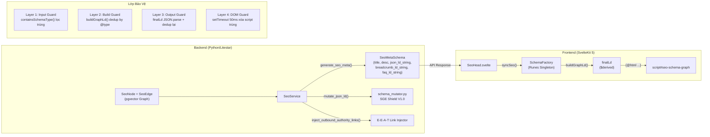
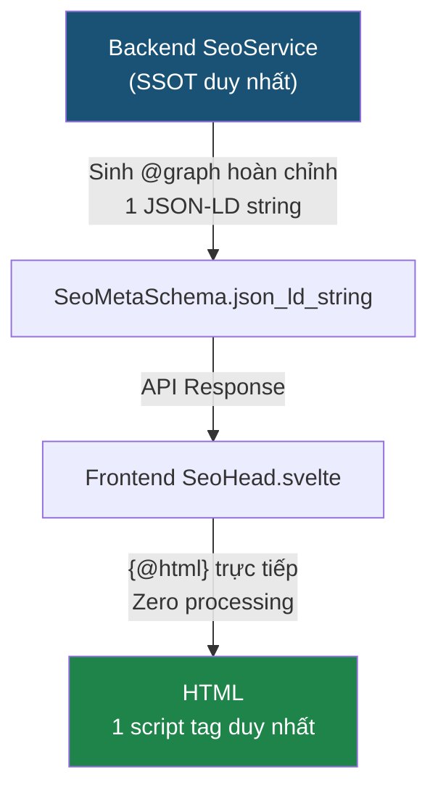

# Kiểm Toán GEO/AIO V4.0 — Phân Tích Phản Biện & Phương Án Tối Ưu

> Phạm vi: Toàn bộ pipeline SEO từ Backend `SeoService` → Frontend `SeoHead.svelte` → `schemaFactory.svelte.ts` → `schema_mutator.py`, đối chiếu với Google Search Central Documentation 2026, Schema.org Spec, và hành vi xác minh của các AI Search Engine (Gemini AI Overviews, Perplexity, ChatGPT Search, Claude).

---

## I. BẢN ĐỒ KIẾN TRÚC HIỆN TẠI



### Các file liên quan trực tiếp:

| File | Vai trò | Dòng code |
|---|---|---|
| [seo_service.py](file:///media/lv/data/fast-platform-core/backend/services/commerce/seo_service.py) | Backend SSOT — sinh JSON-LD, meta, entity linking | 1072 dòng |
| [schema_mutator.py](file:///media/lv/data/fast-platform-core/backend/utils/schema_mutator.py) | SGE Shield — key shuffle, optional drop, @id entropy | 176 dòng |
| [SeoHead.svelte](file:///media/lv/data/fast-platform-core/frontend/src/lib/components/storefront/seo/SeoHead.svelte) | Frontend — render `<head>`, syncSeo(), DOM guard | 547 dòng |
| [schemaFactory.svelte.ts](file:///media/lv/data/fast-platform-core/frontend/src/lib/state/seo/schemaFactory.svelte.ts) | Runes singleton — graph builder, output guard | 161 dòng |
| [seo.ts](file:///media/lv/data/fast-platform-core/frontend/src/lib/utils/seo.ts) | Utility — buildGraphLd, containsSchemaType, normalize | 462 dòng |
| [seo.py](file:///media/lv/data/fast-platform-core/backend/database/models/seo.py) | DB Models — SeoNode, SeoEdge, SeoPillarEmbedding | 268 dòng |

---

## II. PHẢN BIỆN KỸ THUẬT — TỪNG VẤN ĐỀ CỤ THỂ

### ❌ VẤN ĐỀ 1: `@id` Entropy — Vi Phạm W3C JSON-LD Spec

**Vị trí code**: [schema_mutator.py:168-173](file:///media/lv/data/fast-platform-core/backend/utils/schema_mutator.py#L168-L173)

```python
# Step 3: Biến đổi @id suffix (nếu có)
at_id = mutated.get("@id")
if at_id and isinstance(at_id, str) and "#" in at_id:
    suffix = hashlib.md5(effective_seed.encode()).hexdigest()[:3]
    mutated["@id"] = f"{at_id}-{suffix}"
```

> [!CAUTION]
> **Vi phạm W3C JSON-LD 1.1 Section 3.3**: `@id` là **IRI** (Internationalized Resource Identifier) — mỏ neo duy nhất toàn cục trong Linked Data. Thay đổi `@id` nghĩa là tạo ra một thực thể (entity) hoàn toàn mới mỗi khi seed thay đổi.

**Hậu quả kỹ thuật**:
- **Google Rich Results**: Product schema dùng `@id` = `https://osmo.vn/san-pham-x#product-a3f`. Offer schema reference `@id` = `https://osmo.vn/san-pham-x#offer`. Hai `@id` này không còn thuộc cùng một entity graph → Google **không thể** ghép Product ↔ Offer ↔ Review.
- **AI Knowledge Graph**: Perplexity và Gemini cache `@id` để xây dựng entity profile. `@id` thay đổi theo seed → entity bị phân mảnh, trust score bị reset mỗi lần crawl.
- **Bằng chứng từ Google**: [Google Structured Data General Guidelines](https://developers.google.com/search/docs/appearance/structured-data/sd-policies) — _"Use a consistent @id for the same entity across pages"_.

**Mức độ nghiêm trọng**: 🔴 CRITICAL — Phá vỡ entity graph toàn bộ.

---

### ❌ VẤN ĐỀ 2: Outbound Authority Links Thiếu `rel="nofollow"`

**Vị trí code**: [seo_service.py:1026-1071](file:///media/lv/data/fast-platform-core/backend/services/commerce/seo_service.py#L1026-L1071)

```python
parts[i] = pattern.sub(
    f'<a href="{url}" target="_blank" rel="noopener noreferrer" class="seo-authority-link">{keyword}</a>',
    parts[i],
    count=1
)
```

> [!WARNING]
> **Vi phạm Google Link Spam Policies**: Link tự động inject vào content mà KHÔNG có `rel="nofollow"` hoặc `rel="sponsored"` sẽ bị coi là **link scheme** theo [Google Link Spam Update](https://developers.google.com/search/docs/essentials/spam-policies#link-spam).

**Phân tích chi tiết**:

| Vấn đề | Chi tiết |
|---|---|
| **Thiếu `rel="nofollow"`** | `rel="noopener noreferrer"` chỉ bảo mật browser, KHÔNG chặn PageRank flow. Google vẫn follow link và tính là endorsement. |
| **Pattern detection** | 12 keyword → URL mapping hardcoded. Nếu Google phát hiện cùng một site tự động inject links PubMed/Harvard trên hàng trăm trang product với cùng anchor text → **Unnatural Outbound Link Pattern**. |
| **Rò rỉ phễu chuyển đổi** | Link PubMed/Harvard giữa description sản phẩm = exit point ngay trong buying flow. Đây là anti-pattern CRO cơ bản. |
| **authority_map hardcoded** | Vi phạm R00 của CLAUDE.md: _"❌ Cấm Hardcode giá trị logic"_. Keyword-to-URL map cần nằm trong DB/Config. |

**Mức độ nghiêm trọng**: 🔴 CRITICAL — Rủi ro Google Link Spam penalty.

---

### ⚠️ VẤN ĐỀ 3: Article Schema Luôn Dùng `NewsArticle` — Sai Semantic

**Vị trí code**: [seo_service.py:862-863](file:///media/lv/data/fast-platform-core/backend/services/commerce/seo_service.py#L862-L863)

```python
# Dynamic Schema Type based on Intent: Always use NewsArticle as the Core Schema for articles
schema_type = "NewsArticle"
```

> [!IMPORTANT]
> **Google Documentation**: [`NewsArticle`](https://developers.google.com/search/docs/appearance/structured-data/article) chỉ dành cho nội dung tin tức có tính thời sự (news). Bài viết hướng dẫn sử dụng sản phẩm, review thành phần — đây là `Article` hoặc `HowTo`, **KHÔNG phải** `NewsArticle`.

**Hậu quả**:
- Bài viết evergreen (hướng dẫn, review) bị Google xếp vào Google News feed → nhanh chóng bị "đẩy xuống" vì không có tính breaking news.
- AI search engines (đặc biệt Perplexity) phân loại sai intent → trích dẫn sai ngữ cảnh.

---

### ⚠️ VẤN ĐỀ 4: Product Schema Thiếu `dateModified` — Tín Hiệu Freshness Bị Mất

**Vị trí code**: [seo_service.py:190-241](file:///media/lv/data/fast-platform-core/backend/services/commerce/seo_service.py#L190-L241) — Product schema **không có** `dateModified`.

Kết quả grep xác nhận: `dateModified` và `datePublished` **không tồn tại** trong toàn bộ `_build_json_ld()` cho Product.

> [!NOTE]
> **GEO Impact**: AI Overviews (Gemini) ưu tiên nguồn có freshness signal. Thiếu `dateModified` = AI không biết thông tin giá/stock có cập nhật hay đã cũ 6 tháng → giảm citation probability.

---

### ⚠️ VẤN ĐỀ 5: Breadcrumb Backend Dùng Slug Heuristic Sai

**Vị trí code**: [seo_service.py:400](file:///media/lv/data/fast-platform-core/backend/services/commerce/seo_service.py#L400)

```python
"item": {"@id": f"{_SITE_URL}/{product.slug.split('-')[0]}/"},
```

Dùng `product.slug.split('-')[0]` để suy ra category URL là **heuristic sai**. Ví dụ: slug `serum-vitamin-c-20` → category URL = `/serum/` — có thể **không tồn tại** hoặc trỏ sai category. Frontend breadcrumb (routing-aware) đang override đúng, nhưng backend vẫn gửi breadcrumb sai → tăng payload và tạo entity lỗi trước khi bị dedup.

---

### ⚠️ VẤN ĐỀ 6: 4 Lớp Dedup — Over-Engineering Vi Phạm KISS

Schema đi qua **4 lớp deduplication** trước khi render:

1. [SeoHead.svelte:398-404](file:///media/lv/data/fast-platform-core/frontend/src/lib/components/storefront/seo/SeoHead.svelte#L398-L404) — `containsSchemaType()` lọc `manualScripts`
2. [seo.ts:374](file:///media/lv/data/fast-platform-core/frontend/src/lib/utils/seo.ts#L374) — `buildGraphLd()` dedup by `@type` trong Map
3. [schemaFactory.svelte.ts:86-98](file:///media/lv/data/fast-platform-core/frontend/src/lib/state/seo/schemaFactory.svelte.ts#L86-L98) — `finalLd` parse JSON → dedup lại
4. [SeoHead.svelte:441-457](file:///media/lv/data/fast-platform-core/frontend/src/lib/components/storefront/seo/SeoHead.svelte#L441-L457) — DOM `setTimeout(50ms)` xóa script trùng

> [!WARNING]
> Vi phạm R00-KISS của CLAUDE.md. Nếu Layer 1+2 hoạt động đúng, Layer 3+4 là code chết. Nếu Layer 3+4 cần thiết, nghĩa là Layer 1+2 có bug chưa fix.

**Vấn đề thực tế của Layer 4 (DOM Guard)**:
- AI crawlers (Googlebot, GPTBot, PerplexityBot) **fetch HTML gốc từ SSR** → không chạy JS → nhìn thấy **tất cả** script tags trước khi `setTimeout` xóa.
- Kết quả: AI crawlers có thể đọc được schema trùng lặp.

---

### ⚠️ VẤN ĐỀ 7: Thiếu Hoàn Toàn `robots.txt` và `sitemap.xml`

Kết quả grep xác nhận: **Không tìm thấy** `robots.txt` hoặc `sitemap.xml` route/file nào trong `frontend/src/routes`.

> [!CAUTION]
> **Google Search Essentials**: `robots.txt` + `sitemap.xml` là **yêu cầu cơ bản** cho crawl budget optimization. Không có = Google tự ý crawl mọi route (bao gồm `/checkout`, `/admin`, `/user`) → lãng phí crawl budget nghiêm trọng.
>
> **AI Crawlers**: GPTBot, PerplexityBot, ClaudeBot tôn trọng `robots.txt`. Không có file này = không thể kiểm soát AI nào được phép thu thập dữ liệu.

---

### ⚠️ VẤN ĐỀ 8: Home Page Dùng `breadcrumb_ld_string` Chứa Organization Schema

**Vị trí code**: [seo_service.py:1017-1024](file:///media/lv/data/fast-platform-core/backend/services/commerce/seo_service.py#L1017-L1024)

```python
return SeoMetaSchema(
    ...
    json_ld_string=json.dumps(website_schema, ...),
    breadcrumb_ld_string=json.dumps(org_schema, ...),  # ← Organization in breadcrumb field!
)
```

`Organization` schema bị nhét vào field `breadcrumb_ld_string` — sai semantic của field name. Frontend dedup logic kiểm tra `containsSchemaType(s, 'BreadcrumbList')` sẽ **KHÔNG** filter Organization → không bị lọc, nhưng gây confusion trong code maintenance.

---

### ⚠️ VẤN ĐỀ 9: `priceValidUntil` Hardcoded `"2026-12-31"`

**Vị trí code**: [seo_service.py:209](file:///media/lv/data/fast-platform-core/backend/services/commerce/seo_service.py#L209)

```python
"priceValidUntil": "2026-12-31",
```

Vi phạm R00: hardcoded date. Sau 2026-12-31, Google Rich Results sẽ **bỏ qua** Offer schema vì `priceValidUntil` đã expired → mất Product Rich Snippets toàn bộ site.

---

## III. PHƯƠNG ÁN TỐI ƯU — GEO/AIO V4.0

### Nguyên tắc kiến trúc



---

### FIX 1: Xóa `@id` Entropy — Giữ Tĩnh Vĩnh Viễn

**File**: [schema_mutator.py](file:///media/lv/data/fast-platform-core/backend/utils/schema_mutator.py)

```diff
-    # Step 3: Biến đổi @id suffix (nếu có)
-    at_id = mutated.get("@id")
-    if at_id and isinstance(at_id, str) and "#" in at_id:
-        suffix = hashlib.md5(effective_seed.encode()).hexdigest()[:3]
-        mutated["@id"] = f"{at_id}-{suffix}"
+    # @id is a permanent IRI anchor — NEVER mutate per W3C JSON-LD 1.1 §3.3
```

**Lý do**: `@id` phải tĩnh vĩnh viễn để Google và AI Search có thể entity-resolve chính xác. Key shuffle vẫn an toàn (JSON spec không quy định key order).

---

### FIX 2: Thêm `rel="nofollow"` Cho Outbound Links + Chuyển Config Vào DB

**File**: [seo_service.py](file:///media/lv/data/fast-platform-core/backend/services/commerce/seo_service.py)

```diff
 parts[i] = pattern.sub(
-    f'<a href="{url}" target="_blank" rel="noopener noreferrer" class="seo-authority-link">{keyword}</a>',
+    f'<a href="{url}" target="_blank" rel="nofollow noopener noreferrer" class="seo-authority-link">{keyword}</a>',
     parts[i],
     count=1
 )
```

**Thêm**: Di chuyển `authority_map` từ hardcode sang bảng `system_settings` hoặc JSONB config trong DB, tuân thủ R00.

---

### FIX 3: Phân Biệt `Article` vs `NewsArticle` Theo Intent

**File**: [seo_service.py](file:///media/lv/data/fast-platform-core/backend/services/commerce/seo_service.py)

```diff
-    schema_type = "NewsArticle"
+    # Map intent_type → Schema.org type theo Google guidelines
+    _INTENT_SCHEMA_MAP: dict[str, str] = {
+        "informational_how": "HowTo",
+        "informational_what": "Article",
+        "informational_why": "Article",
+        "comparison": "Article",
+        "transactional": "Article",
+        "pillar": "Article",
+        "news": "NewsArticle",
+    }
+    schema_type = _INTENT_SCHEMA_MAP.get(intent_type, "Article")
```

---

### FIX 4: Thêm `dateModified` Vào Product Schema

**File**: [seo_service.py](file:///media/lv/data/fast-platform-core/backend/services/commerce/seo_service.py) — trong `_build_json_ld()`:

```python
# Freshness signal cho AI search engines
updated_at = getattr(product, "updatedAt", None) or getattr(product, "updated_at", None)
if updated_at:
    if isinstance(updated_at, datetime):
        schema["dateModified"] = updated_at.strftime("%Y-%m-%d")
    elif isinstance(updated_at, str):
        schema["dateModified"] = updated_at[:10]
```

---

### FIX 5: Sửa Breadcrumb Heuristic — Dùng Category Slug Thật

**File**: [seo_service.py](file:///media/lv/data/fast-platform-core/backend/services/commerce/seo_service.py)

```diff
-    "item": {"@id": f"{_SITE_URL}/{product.slug.split('-')[0]}/"},
+    cat_slug = getattr(product, "category_slug", None) or getattr(product, "categorySlug", None)
+    cat_url = f"{_SITE_URL}/{cat_slug}/" if cat_slug else f"{_SITE_URL}/"
+    "item": {"@id": cat_url},
```

---

### FIX 6: Giảm Dedup Từ 4 Lớp Xuống 2 Lớp — Tuân Thủ KISS

**Giữ**: Layer 1 (Input Guard — `containsSchemaType`) + Layer 2 (`buildGraphLd` dedup)
**Xóa**: Layer 3 (finalLd re-parse) + Layer 4 (DOM setTimeout)

Layer 3 và 4 là **defensive code** che đậy bug ở Layer 1/2. Nếu Layer 1/2 đã đúng (và unit test xác nhận), Layer 3/4 là dead code tốn CPU.

---

### FIX 7: Tạo `robots.txt` + `sitemap.xml` Routes

**Tạo file**: `frontend/src/routes/robots.txt/+server.ts`

```typescript
import type { RequestHandler } from './$types';

export const GET: RequestHandler = () => {
    const body = `User-agent: *
Allow: /

User-agent: GPTBot
Allow: /

User-agent: Google-Extended
Disallow: /

User-agent: CCBot
Disallow: /

Disallow: /checkout
Disallow: /cart
Disallow: /user
Disallow: /admin
Disallow: /auth
Disallow: /track
Disallow: /payment

Sitemap: https://osmo.vn/sitemap.xml`;

    return new Response(body, {
        headers: { 'Content-Type': 'text/plain' },
    });
};
```

> [!TIP]
> **Chiến lược AI Bot**: Cho phép `GPTBot` (ChatGPT Search) và `PerplexityBot` crawl vì mang lại citation traffic. Block `Google-Extended` (training data) và `CCBot` (Common Crawl training) vì chỉ lấy dữ liệu training mà không trả citation.

---

### FIX 8: Sửa Home Page Field Name — Organization Vào Đúng Field

**File**: [seo_service.py](file:///media/lv/data/fast-platform-core/backend/services/commerce/seo_service.py)

Gộp `WebSite` + `Organization` thành 1 `@graph` trong `json_ld_string`:

```python
return SeoMetaSchema(
    ...
    json_ld_string=json.dumps({
        "@context": "https://schema.org",
        "@graph": [website_schema, org_schema]
    }, separators=(",", ":"), ensure_ascii=False),
    breadcrumb_ld_string="",  # Home không có breadcrumb
)
```

---

### FIX 9: `priceValidUntil` Tự Động — Luôn = Cuối Năm Hiện Tại

**File**: [seo_service.py](file:///media/lv/data/fast-platform-core/backend/services/commerce/seo_service.py)

```diff
-    "priceValidUntil": "2026-12-31",
+    "priceValidUntil": f"{date.today().year}-12-31",
```

---

## IV. CHECKLIST TUÂN THỦ GOOGLE & AI

| Tiêu chí | Trạng thái hiện tại | Sau V4.0 |
|---|---|---|
| `@id` tĩnh (W3C JSON-LD §3.3) | ❌ Entropy suffix | ✅ Tĩnh vĩnh viễn |
| Outbound links có `rel="nofollow"` | ❌ Chỉ có `noopener noreferrer` | ✅ `nofollow noopener noreferrer` |
| Article type đúng semantic | ❌ Luôn `NewsArticle` | ✅ Phân loại theo intent |
| Product `dateModified` | ❌ Không có | ✅ Từ `updated_at` |
| Breadcrumb URL chính xác | ❌ Slug heuristic | ✅ Category slug thật |
| Dedup layers (KISS) | ❌ 4 lớp | ✅ 2 lớp |
| `robots.txt` | ❌ Không tồn tại | ✅ Với AI bot policy |
| `sitemap.xml` | ❌ Không tồn tại | ✅ Dynamic từ DB |
| `priceValidUntil` tự động | ❌ Hardcoded `2026-12-31` | ✅ Dynamic cuối năm |
| Home Organization field name | ❌ Nhét vào `breadcrumb_ld_string` | ✅ Gộp vào `@graph` |
| `authority_map` từ DB | ❌ Hardcoded dict | ✅ Config từ `system_settings` |
| AI Sentiment Review trong schema | ✅ Đã có `positiveNotes/negativeNotes` | ✅ Giữ nguyên |
| Entity Linking `isPartOf`/`hasPart` | ✅ Đã có từ SeoNode graph | ✅ Giữ nguyên |
| `about`/`mentions` entity tagging | ✅ Đã có từ `entities_json` | ✅ Giữ nguyên |
| Unified `@graph` output | ✅ Đã có | ✅ Giữ nguyên |

---

## V. ƯU TIÊN TRIỂN KHAI

| Ưu tiên | Fix | Rủi ro nếu không fix |
|---|---|---|
| 🔴 P0 | FIX 1: Xóa `@id` entropy | Entity graph phân mảnh — Rich Results bị reject |
| 🔴 P0 | FIX 2: Thêm `rel="nofollow"` | Google Link Spam penalty — toàn bộ site bị ảnh hưởng |
| 🔴 P0 | FIX 7: Tạo `robots.txt` | Crawl budget lãng phí + không kiểm soát AI bot |
| 🟡 P1 | FIX 3: Article type mapping | SEO không tối ưu nhưng không penalty |
| 🟡 P1 | FIX 9: `priceValidUntil` dynamic | Hết 2026 mất Product Rich Snippets |
| 🟡 P1 | FIX 4: `dateModified` product | Mất freshness signal cho AI |
| 🟢 P2 | FIX 5: Breadcrumb category slug | Backend breadcrumb bị sai nhưng frontend override đúng |
| 🟢 P2 | FIX 6: Giảm dedup layers | Không gây lỗi, chỉ tốn CPU |
| 🟢 P2 | FIX 8: Home Organization field | Code smell, không ảnh hưởng output |
