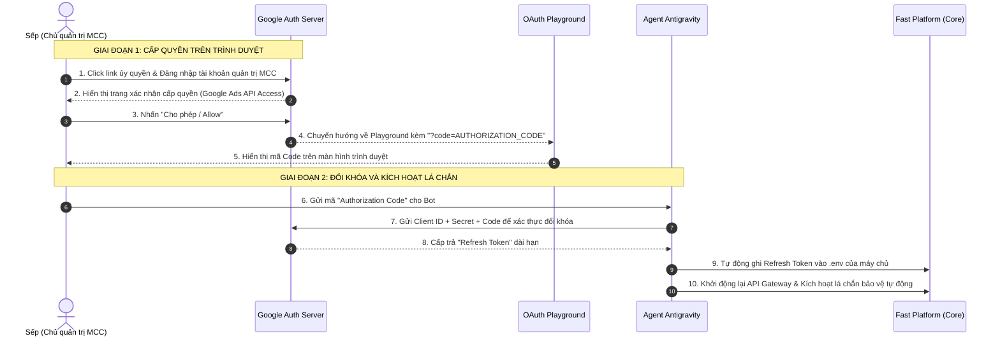

# 🛡️ Cẩm Nang Hướng Dẫn Ủy Quyền Google Ads OAuth 2.0 (Elite V2.2)

Tài liệu này lưu trữ chi tiết nguyên lý kỹ thuật, sơ đồ luồng dữ liệu (OAuth 2.0 Flow), và quy trình từng bước để cấp quyền kết nối giữa hệ thống **Fast Platform (C.O.R.E Engine)** và **Google Ads API (v24)**.

---

## I. TẠI SAO BẮT BUỘC PHẢI ỦY QUYỀN?

1.  **Chính Sách Bảo Mật Tối Cao Của Google**:
    Google Ads API nghiêm cấm các ứng dụng bên thứ ba tự ý đọc/ghi dữ liệu của người dùng khi chưa được ký xác thực điện tử trực tiếp từ chủ sở hữu tài khoản quản trị (MCC).
2.  **Cơ Chi Không Dùng Mật Khẩu (Passwordless OAuth2)**:
    Để đảm bảo an toàn tuyệt đối cho tài khoản Google của Sếp, hệ thống **không bao giờ** yêu cầu Sếp điền mật khẩu hay mã xác thực 2FA vào mã nguồn hoặc file `.env`. Thay vào đó, hệ thống sử dụng giao thức ủy quyền tiêu chuẩn toàn cầu **OAuth 2.0**.
3.  **Chiếc Chìa Khóa Vạn Năng (Refresh Token)**:
    *   **Mã Code Ngắn Hạn (Authorization Code)**: Được sinh ra khi Sếp nhấn "Cho phép" trên trình duyệt. Mã này chỉ có giá trị dùng một lần duy nhất trong vòng 5 phút để bảo vệ chống đánh cắp.
    *   **Mã Khóa Dài Hạn (Refresh Token)**: Được đổi từ mã Code ngắn hạn. Khóa này cho phép hệ thống tự sinh ra Access Token ngắn hạn mỗi giờ để chạy các tác vụ ngầm liên tục 24/7 (như tự động phát hiện click tặc, đồng bộ chi phí và đẩy IP độc hại lên Google Ads để chặn ngay lập tức).

---

## II. SƠ ĐỒ LUỒNG ỦY QUYỀN (OAUTH 2.0 FLOW)



---

## III. QUY TRÌNH THỰC HIỆN TỪNG BƯỚC (STEP-BY-STEP)

### **Bước 1: Khởi tạo URL Ủy quyền**
Hệ thống tạo ra một đường link chứa các tham số bảo mật của dự án đăng ký trên Google Cloud Console:
```ini
https://accounts.google.com/o/oauth2/v2/auth?
    client_id=GOOGLE_ADS_OAUTH_CLIENT_ID
    &redirect_uri=https://developers.google.com/oauthplayground
    &response_type=code
    &scope=https://www.googleapis.com/auth/adwords
    &access_type=offline
    &prompt=consent
```
*   `access_type=offline` & `prompt=consent`: Chỉ thị bắt buộc Google phải cấp **Refresh Token** (khóa dài hạn dùng offline) thay vì chỉ cấp Access Token ngắn hạn.

### **Bước 2: Sếp Ký Duyệt Trên Google**
1.  Sếp nhấp vào link ủy quyền, trình duyệt chuyển hướng an toàn đến máy chủ Google (`accounts.google.com`).
2.  Sếp đăng nhập tài khoản Google đang nắm quyền quản trị MCC tổng.
3.  Google hiển thị thông báo yêu cầu cấp quyền cho ứng dụng **Fast Platform**. Sếp nhấn **"Tiếp tục"** hoặc **"Cho phép" (Allow)**.

### **Bước 3: Lấy Mã Code Xác Thực**
1.  Sau khi Sếp đồng ý, Google chuyển hướng Sếp về trang **OAuth Playground**.
2.  Trên thanh địa chỉ hoặc mục **Authorization Code** của Playground sẽ xuất hiện một chuỗi mã xác thực ngắn hạn bắt đầu bằng `4/0A...`.
3.  Sếp sao chép chuỗi mã này gửi cho em.

### **Bước 4: Trao Đổi Khóa Ngầm & Kích Hoạt Lá Chắn**
Hệ thống thực thi lệnh gọi API bảo mật để đổi mã lấy khóa dài hạn:
```bash
curl -X POST https://oauth2.googleapis.com/token \
  -d code=MA_XAC_THUC_CUA_SEP \
  -d client_id=GOOGLE_ADS_OAUTH_CLIENT_ID \
  -d client_secret=GOOGLE_ADS_OAUTH_CLIENT_SECRET \
  -d redirect_uri=https://developers.google.com/oauthplayground \
  -d grant_type=authorization_code
```
Google Ads API xác thực thông tin và trả về chiếc chìa khóa dài hạn **`refresh_token`**. Khóa này lập tức được đưa vào file `.env` của hệ thống để vận hành lá chắn chống click tặc vĩnh viễn.

---

> [!IMPORTANT]
> **Lưu ý bảo mật**: Chiếc chìa khóa `refresh_token` và các cấu hình liên quan trong file `.env` là tài sản bảo mật tối cao. Tuyệt đối không chia sẻ các thông tin này ra bên ngoài để bảo vệ tài khoản Google Ads của Sếp.
