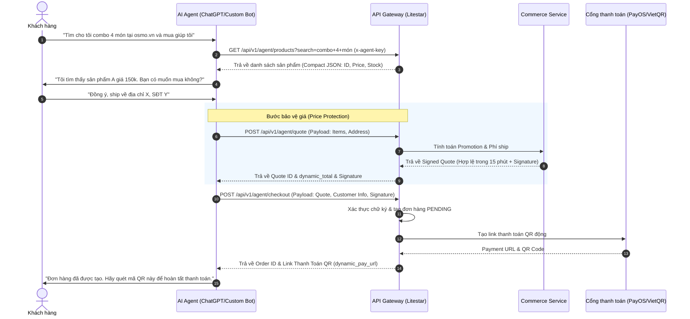

# Phân tích & Kế hoạch nâng cấp mở cổng cho AI Agent tìm kiếm và mua hàng tại osmo.vn

Tài liệu này phân tích chi tiết hiện trạng hệ thống `osmo.vn` và đề xuất phương án kiến trúc nhằm "mở cổng" (open APIs/endpoints) cho các AI Agent (bao gồm AI Search Engine như Perplexity/ChatGPT Search, custom shopping bots, hoặc các tác nhân chạy qua Model Context Protocol - MCP) có thể thực hiện tìm kiếm sản phẩm và đặt hàng một cách tự động, bảo mật và tối ưu chi phí.

---

## User Review Required

> [!IMPORTANT]
> **Cần quyết định về mức độ cởi mở và bảo mật của cổng AI:**
> 1. **Chế độ thanh toán cho AI Agent:** Đơn đặt hàng từ AI Agent có cho phép thanh toán COD (Nhận hàng trả tiền) trực tiếp không? Nhằm tránh spam đặt đơn khống (DDoS kho hàng), đề xuất bắt buộc **Xác thực 2 bước (OTP SMS / SMS Link)** đối với COD, hoặc chỉ cho phép **Thanh toán trực tuyến (Dynamic QR/PayOS)** rồi trả link thanh toán cho Agent.
> 2. **Authentication (Xác thực Agent):** Cho phép các AI Agent công cộng (như ChatGPT Actions, Custom GPTs) gọi API không cần token (unauthenticated) hay yêu cầu đăng ký **Agent API Key** (`x-agent-key`) để kiểm soát traffic và tính phí hoa hồng/affiliate?
> 3. **Cấu hình Robots.txt:** Cho phép AI Crawlers truy cập trang storefront để index sản phẩm (SGE - Search Generative Experience), nhưng tiếp tục block các bot thu thập dữ liệu huấn luyện (Training Bots) để bảo vệ IP dữ liệu.

---

## Open Questions

> [!WARNING]
> **Các câu hỏi kỹ thuật cần làm rõ trước khi code:**
> - Hệ thống có cần hỗ trợ cơ chế chia sẻ doanh thu / Affiliate trực tiếp cho AI Agent thông qua việc ghi nhận `agent_id` vào trường đơn hàng hay không?
> - Các Agent có cần truy xuất số dư Loyalty Points của người dùng thông qua API để áp dụng giảm giá điểm thưởng lúc checkout không? Nếu có, cơ chế liên kết tài khoản (Account Linking) giữa User và Agent sẽ được thực hiện như thế nào (ví dụ qua OAuth2)?

---

## 1. Phân tích hiện trạng hệ thống

Qua rà soát mã nguồn, hệ thống hiện có các điểm nghẽn/hạn chế đối với AI Agent như sau:

| Thành phần | Hiện trạng | Hạn chế đối với AI Agent |
| :--- | :--- | :--- |
| **Robots.txt** | Block toàn bộ AI crawlers (`GPTBot`, `ClaudeBot`, `PerplexityBot`,...) | AI Search Engines không thể crawl và hiển thị sản phẩm của `osmo.vn` trong kết quả tìm kiếm tự nhiên. |
| **MCP (Model Context Protocol)** | Chỉ mở ở `/api/v1/mcp` và bị chặn bởi `PermissionGuard(PermissionEnum.SYS_ADMIN)` | Chỉ có Admin/System Agent mới dùng được MCP. Đối tác bên ngoài hoặc AI của khách hàng không thể kết nối. |
| **API Tìm kiếm** | Endpoint `/api/v1/client/products` trả về JSON rất lớn (nhiều metadata, ảnh, SEO meta) | Tốn Token Context của LLM. AI Agent cần dữ liệu tinh gọn (Compact JSON). |
| **API Mua hàng** | Endpoint `/api/v1/client/checkout/stealth` dùng cookie, có cơ chế `anti_spam_service` quét IP/User-Agent khá chặt | Headless Agent dễ bị nhận diện là Spam/Bot và bị Block. Chưa có cơ chế trả về cổng thanh toán online thân thiện với Agent. |

---

## 2. Kiến trúc giải pháp đề xuất

Sơ đồ luồng tương tác của AI Agent với hệ thống `osmo.vn`:



---

## 3. Các thay đổi đề xuất

Để hiện thực hóa tính năng này, ta sẽ triển khai các thành phần sau:

### Component 1: Cấu hình Crawler & SEO (Robots.txt & Svelte Frontend)

#### [MODIFY] [robots.txt](file:///media/lv/data/fast-platform-core/frontend/static/robots.txt)
Cho phép các Bot tìm kiếm của AI truy cập các trang sản phẩm công khai, nhưng vẫn chặn các bot thu thập dữ liệu huấn luyện (Training scrapers).

```diff
- User-agent: GPTBot
- Disallow: /
+ User-agent: GPTBot
+ Disallow: /
+ 
+ # Cho phép các bot tìm kiếm thời gian thực của AI đọc trang sản phẩm
+ User-agent: OAI-SearchBot
+ Allow: /products/
+ Disallow: /
+ 
+ User-agent: PerplexityBot
+ Allow: /products/
+ Disallow: /
+ 
+ User-agent: Claude-Web
+ Allow: /products/
+ Disallow: /
```

#### [NEW] [.well-known/ai-agents.txt](file:///media/lv/data/fast-platform-core/frontend/static/.well-known/ai-agents.txt)
Cung cấp hướng dẫn trực tiếp cho AI Agents khi ghé thăm trang web, trỏ tới OpenAPI Schema và các nguyên tắc tương tác.

---

### Component 2: API Gateway dành riêng cho AI Agent (`/api/v1/agent/`)

Tách biệt hoàn toàn luồng xử lý của Agent ra một Route Group riêng để áp dụng Rate limit và Authentication độc lập.

#### [NEW] [agent_product.py](file:///media/lv/data/fast-platform-core/backend/controllers/agent/product.py)
Controller cung cấp API tìm kiếm tối ưu hóa dung lượng JSON (Compact Response) giúp tiết kiệm token cho AI Agent.

```python
# API: GET /api/v1/agent/products
# Trả về: id, name, slug, price, discount_price, stock, image_url (tinh gọn)
```

#### [NEW] [agent_checkout.py](file:///media/lv/data/fast-platform-core/backend/controllers/agent/checkout.py)
Controller xử lý Checkout 2 bước cho Agent:
1. `/quote`: Kiểm tra tồn kho, khuyến mãi, tính phí vận chuyển và trả về một `signed_payload` kèm signature (HMAC) để tránh việc Agent tự ý sửa giá sản phẩm lúc checkout.
2. `/checkout`: Tiếp nhận thông tin giao hàng, kiểm tra signature, tạo đơn hàng trạng thái `PENDING_PAYMENT`, gọi cổng thanh toán để sinh mã QR và trả về cho Agent.

---

### Component 3: Public MCP Server (`/api/v1/agent/mcp`)

#### [NEW] [public_router.py](file:///media/lv/data/fast-platform-core/backend/routers/mcp/public_router.py)
Expose một cổng MCP công khai (hoặc bảo vệ bằng API Key) cho phép AI Agents kết nối bằng giao thức Model Context Protocol để gọi trực tiếp các tool tìm kiếm và mua hàng.

Các Tool an toàn được đăng ký:
- `agent_search_products`: Tìm kiếm sản phẩm ngữ nghĩa.
- `agent_get_product_detail`: Xem chi tiết sản phẩm và các biến thể.
- `agent_request_quote`: Lấy báo giá đơn hàng tạm tính.
- `agent_submit_order`: Gửi đơn đặt hàng và nhận link QR thanh toán.

---

### Component 4: Database & Security Adjustments

#### [MODIFY] [models.py](file:///media/lv/data/fast-platform-core/backend/database/models/commerce.py)
Thêm các cột phục vụ quản lý đơn hàng từ Agent:
- `agent_id` (String, nullable): Xác định Agent/Đối tác thực hiện đơn hàng.
- `agent_metadata` (JSON, nullable): Lưu trữ thông tin thiết bị, hội thoại của Agent.
- `verification_status` (Enum: PENDING, VERIFIED, BYPASSED): Trạng thái xác thực OTP đối với đơn COD.

---

## Verification Plan

### Automated Tests
- Viết test suite giả lập cuộc gọi từ AI Agent (không gửi cookie, chỉ gửi `x-agent-key`):
  1. Gọi `GET /api/v1/agent/products` -> Kiểm tra schema JSON gọn nhẹ.
  2. Gọi `POST /api/v1/agent/quote` -> Nhận signed payload.
  3. Gọi `POST /api/v1/agent/checkout` -> Xác thực signature thành công và trả về mã QR PayOS hợp lệ.
  4. Test trường hợp sửa giá trong payload gửi lên `/checkout` -> Hệ thống phải chặn và báo lỗi Price Manipulation.

### Manual Verification
- Cấu hình một Custom GPT trên ChatGPT (hoặc Claude Project) trỏ tới file OpenAPI schema `/schema` của `osmo.vn` (môi trường staging).
- Thực hiện hội thoại: *"Tìm mua combo trị mụn tại osmo.vn"* -> Xem Agent có gọi đúng API và hiển thị sản phẩm kèm link thanh toán hay không.
